# Feature: HedgeDoc Document Intelligence (Hệ Thống Tác Nhân Khai Thác Tri Thức Tài Liệu Doanh Nghiệp)

> **Tài liệu tham chiếu chuẩn**: [`specs/plugin-assistant/template-spec-readme.md`](plugin-assistant/template-spec-readme.md)  
> **Kiến trúc nghiệp vụ nền tảng**: [`specs/plugin-assistant/document-intelligence.md`](plugin-assistant/document-intelligence.md)  
> **Nhật ký kỹ thuật & Hiện trạng**: [`ghichu.md`](ghichu.md)  

**Vị trí mã nguồn dự kiến:**

| Layer | Đường dẫn | Trách nhiệm |
|---|---|---|
| **Frontend** | `frontend/app.py`, `frontend/components.py`, `frontend/styles.css` | Giao diện Streamlit tối giản, hỗ trợ Fast/Thinking toggle, Drawer suy luận, trích dẫn số trang/vị trí |
| **Backend Orchestration** | `backend/rag_engine.py`, `backend/prompts.py`, `backend/memory.py` | Điều phối truy vấn đa bước (Fast/Thinking), kiểm tra phả hệ pháp lý, bảo chứng trích dẫn |
| **Data & Storage Layer** | `data_layer/loader.py`, `data_layer/chunker.py`, `data_layer/vector_store.py`, `data_layer/graph_store.py` | Bóc tách đa định dạng (PDF/DOCX/XLSX), bảo tồn bảng biểu, quản lý Vector (ChromaDB) & Phả hệ (Graph) |
| **AI Providers** | `backend/providers/` (`ollama_provider.py`, `gemini_provider.py`, `openai_provider.py`) | Cung cấp adapter LLM/Embedding linh hoạt (100% Offline Local hoặc Secure Cloud Fallback) |

---

## 1. Tầm Nhìn & Định Vị

- **Vấn đề thực tế**: 
  1. Doanh nghiệp mất hàng giờ tra cứu thủ công trong hàng nghìn hợp đồng, quy chế, báo cáo tài chính rải rác.
  2. Rủi ro áp dụng các điều khoản, thông tư cũ đã bị sửa đổi, bổ sung hoặc bãi bỏ bởi văn bản mới hơn.
  3. Các hệ thống RAG thông thường (Naive RAG) thường xuyên bịa đặt (hallucination), cắt vụn bảng số liệu tài chính và không chỉ ra được chứng cứ trang/dòng xác thực.
- **Định vị giải pháp**:
  > **HedgeDoc Document Intelligence** là hệ thống AI phân tích văn bản chuyên sâu, tự động nhận diện cấu trúc phân cấp, bảo toàn 100% dữ liệu bảng biểu, quản lý phả hệ hiệu lực pháp lý và trả lời với độ chính xác tuyệt đối kèm chứng cứ đối chứng trực tiếp.
- **Tôn chỉ thiết kế**:
  1. 🛡️ **Air-Gapped First (Ưu tiên vận hành nội bộ)**: Khả năng chạy 100% offline trên máy trạm thông thường mà không cần GPU đắt đỏ, bảo vệ bí mật kinh doanh.
  2. 🎯 **Grounding over Fluency (Bằng chứng cao hơn văn vẻ)**: Thà từ chối trả lời (*fail-closed*) còn hơn để AI suy diễn sai sự thật. Mọi câu trả lời bắt buộc dẫn chứng trang và trích đoạn.
  3. ⚙️ **Determinism over Stochastic Retrieval (Chính xác hơn đoán mò)**: Số hiệu văn bản, điều khoản, ngày ban hành phải được lọc chính xác tuyệt đối qua Metadata & Inverted Index, không phó mặc cho vector xác suất.

---

## 2. Nguyên Lý Kiến Trúc

- **Hai chế độ suy luận linh hoạt (Dual Inference Modes)**:
  - **Fast Mode (SLA < 30s)**: Tra cứu nhanh nội dung, định nghĩa, số liệu đơn lẻ qua Hybrid Retrieval (Vector + Keyword BM25).
  - **Thinking Mode (SLA 30s – 90s)**: Kích hoạt lập luận sâu: Phân tách câu hỏi, duyệt đồ thị phả hệ pháp lý để kiểm tra tính còn hiệu lực, đối chiếu chéo nhiều văn bản trước khi đưa ra kết luận.
- **Parent-Child & Table-Preserving Chunking**:
  - Bảo tồn nguyên vẹn cấu trúc bảng biểu tài chính (Excel, Word tables) kèm đầy đủ tiêu đề cột.
  - Phân cấp Cha (Chương/Mục/Điều) – Con (Khoản/Điểm) giúp vừa định vị chuẩn xác, vừa cung cấp đủ ngữ cảnh cho LLM.
- **Fail-Closed & Resilience Fallback**:
  - Gặp tài liệu lỗi trang: Cách ly riêng trang lỗi (*Page-level Quarantine*), tiếp tục nạp bình thường các trang còn lại.
  - Phát hiện văn bản hết hiệu lực: Giương cờ cảnh báo đỏ ngay đầu phản hồi trước khi trích dẫn nội dung.

---

## 3. Sơ Đồ Kiến Trúc & Quy Trình

```mermaid
flowchart TD
    subgraph INGESTION["1. Luồng Nạp Tài Liệu (Zero-Config Ingestion)"]
        DOC["Văn bản đầu vào<br/>(PDF, DOCX, XLSX)"] --> LOADER["MultiFormat Loader<br/>(PyMuPDF, python-docx, openpyxl)"]
        LOADER --> CHUNKER["Parent-Child Chunker<br/>(Bảo toàn bảng biểu tài chính)"]
        CHUNKER --> META["Trích xuất Metadata & Phả hệ<br/>(Số hiệu, Ngày ban hành, Căn cứ/Bãi bỏ)"]
        META --> DB_VEC[("ChromaDB<br/>(Vector Embeddings)")]
        META --> DB_GRAPH[("Graph Lineage<br/>(Phả hệ thay thế/sửa đổi)")]
    end

    subgraph QUERY["2. Luồng Xử Lý Truy Vấn (Fast vs. Thinking)"]
        USER_Q["Câu hỏi người dùng"] --> ROUTE{"Chế độ suy luận"}
        
        ROUTE -- "Fast Mode" --> FAST_RET["Hybrid Retrieval<br/>(Vector + BM25)"]
        FAST_RET --> FAST_GEN["LLM Response<br/>(SLA < 30s kèm Citations)"]
        
        ROUTE -- "Thinking Mode" --> THINK_DECOMPOSE["Phân rã câu hỏi & Nhận diện thực thể"]
        THINK_DECOMPOSE --> GRAPH_CHECK["Tra cứu Đồ thị Phả hệ<br/>(Kiểm tra hiệu lực pháp lý)"]
        GRAPH_CHECK --> THINK_RET["Cross-Document Hybrid Retrieval & Rerank"]
        THINK_RET --> THINK_GEN["Reasoning & Synthesis<br/>(Cảnh báo hiệu lực + Trích dẫn chi tiết)"]
    end
```

---

## 4. Danh Mục Công Nghệ Chốt

- **Giao diện người dùng**: **Streamlit** (hỗ trợ Dark Mode, Chat Streaming, Thinking Drawer, Citation Badges).
- **Ngôn ngữ & Runtime**: **Python 3.14 / 3.11+**.
- **Vector Database**: **ChromaDB** (Persistent on-disk, lưu embeddings 768 chiều).
- **Lưu trữ Phả hệ & Metadata**: **SQLite** (WAL mode) / **NetworkX** (Graph Lineage).
- **Reranker Engine**: **Hybrid Reranker** (Vector Cosine + Lexical BM25/Keyword Density + Reciprocal Rank Fusion RRF).
- **Mô hình AI Mặc định (Local Air-Gapped)**:
  - LLM: `qwen2.5:7b` (qua Ollama) trên máy 16GB RAM.
  - Embedding: `nomic-embed-text:latest` (qua Ollama, 768 dimensions).
- **Mô hình Tùy chọn (Cloud / Accelerated)**:
  - Gemini (`gemini-2.5-flash`), OpenAI (`gpt-4o-mini`, `text-embedding-3-large`).

---

## 5. Đánh Đổi Kiến Trúc

| Hạng mục | Chọn | Từ chối | Căn cứ |
|---|---|---|---|
| **Lưu trữ đồ thị** | SQLite Graph Table / NetworkX | Cụm Neo4j độc lập | Tiết kiệm 3-4GB RAM, phù hợp máy trạm 16GB CPU và có thể chạy được trên máy 4GB. |
| **Giao diện** | Streamlit chuyên sâu | Viết lại React/Vite từ đầu | Giữ vững tốc độ hoàn thiện sản phẩm; tập trung nguồn lực giải quyết bài toán cốt lõi ở Backend và RAG Engine. |
| **Chế độ suy luận** | Tách riêng Fast / Thinking Mode | Một luồng suy luận cố định | Cân bằng hoàn hảo giữa nhu cầu tra cứu tức thì (<30s) và nhu cầu thẩm định pháp lý/tài chính sâu sắc (<90s). |

---

## 6. Bất Biến Hệ Thống

- `[INV-HEDGE-01] Zero Hallucination`: Không tự ý bổ sung sự kiện nằm ngoài tập văn bản đã được lập chỉ mục.
- `[INV-HEDGE-02] Mandatory Page Citation`: Mọi thông tin trích xuất bắt buộc phải gắn kèm `location_label` (Số trang PDF, Heading Word, hoặc Sheet/Dòng Excel).
- `[INV-HEDGE-03] Table Integrity`: Bảng biểu tài chính không bao giờ bị cắt cụt tiêu đề cột giữa các chunk.
- `[INV-HEDGE-04] Legal Status Transparency`: Nếu phát hiện tài liệu đã bị sửa đổi/thay thế, hệ thống bắt buộc cảnh báo người dùng trước khi trích dẫn nội dung chi tiết.

---

## 7. Non-Goals & Anti-Patterns

- **Cố tình không làm**:
  - Không xây dựng trình soạn thảo văn bản hoặc IDE can thiệp mã nguồn (chúng ta tập trung 100% vào Document Intelligence).
  - Không cố gắng chạy các mô hình LLM siêu lớn 70B tham số cục bộ trên CPU thông thường.
- **Cấm (Anti-patterns)**:
  - Cấm nuốt lỗi im lặng (*fail-silently*); lỗi phải hiển thị rõ ràng cho người dùng.
  - Cấm tự ý gửi dữ liệu nội bộ lên các API Cloud công cộng khi người dùng đang bật cờ `AIR_GAPPED_MODE=true`.

---

## 8. Miền Kiểm Chứng Điển Hình

| Miền dữ liệu | Thách thức chính | Tiêu chuẩn nghiệm thu |
|---|---|---|
| **Văn bản pháp lý & Quy chế** | Văn bản nhiều tầng nấc (Điều, Khoản), sửa đổi chéo nhau | Bắt chính xác số hiệu điều khoản, cảnh báo đúng văn bản hết hiệu lực. |
| **Báo cáo tài chính (Excel)** | Bảng biểu nhiều sheet, số liệu hàng nghìn ô | Trả lời chính xác doanh thu, chi phí, lợi nhuận gộp theo từng quý không bị nhầm dòng. |
| **Hợp đồng & Tài liệu dài (>200 trang)** | Quá tải bộ nhớ, nghẽn nạp tài liệu | Nạp từng lô (*save-per-batch*), hỗ trợ nạp tiếp khi gián đoạn, thời gian trả lời Fast < 30s. |

---

## 9. Tham Chiếu

- Quy trình FSP 6 chặng tại `specs/plugin-assistant/index.md`.
- Hướng dẫn áp dụng tại `specs/plugin-assistant/how-to-apply.md`.
