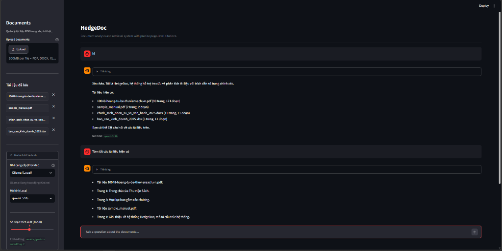

# HedgeDoc

**HedgeDoc** is an intelligent, NotebookLM-style Retrieval-Augmented Generation (RAG) system engineered for high factual precision, zero hallucination, and source traceability. 

It supports multi-format document ingestion (**PDF, Word, Excel**), hybrid provider routing (**Google Gemini, OpenAI, and Local Ollama**), and an intuitive UI with on-the-fly model switching and cross-document comparison.



---

## Key Features

- **Multi-Format Ingestion**:
  - **PDF (`.pdf`)**: Page-level layout and text extraction via `pypdf`.
  - **Word (`.docx`)**: Heading, section, and paragraph-level parsing via `python-docx`.
  - **Excel (`.xlsx`, `.xls`)**: Tabular data ingestion grouped by Sheet and row ranges via `pandas` & `openpyxl`.
- **Flexible Provider Architecture (Cloud + Local)**:
  - **Google Gemini**: Powered by `gemini-2.5-flash` (1,500 requests/day on standard free tier) with automatic fallback.
  - **OpenAI**: Supports `gpt-4o-mini`, `gpt-4o`, and embeddings.
  - **Ollama (100% Local & Offline)**: Run local open-source models like `qwen2.5:7b`, `llama3.1:8b`, or `deepseek-r1:8b` with real-time streaming and local model auto-discovery.
- **Dynamic Model Selector**:
  - Switch providers and models instantly in the sidebar without restarting the server or losing chat memory.
- **Cross-Document Diverse Retrieval**:
  - Automatically identifies comparative and overview queries (e.g., *"So sánh các điểm khác biệt giữa các tài liệu đã nạp"*), pulling representative chunks from **every indexed document** to prevent omission.
- **Strict Grounding & Clean Presentation**:
  - Zero hallucination: answers strictly adhere to provided document context.
  - Clean text responses: citations are decoupled from answer prose and aggregated into a neat, collapsible **Sources & Citations** panel.
- **Minimalist Aesthetic**:
  - Elegant dark theme interface built with Streamlit, real-time token streaming, and collapsible reasoning drawer.

---

## System Architecture

```text
HedgeDoc/
├── backend/
│   ├── providers/          # Modular LLM & Embedding providers (Factory Pattern)
│   │   ├── base.py         # Abstract interfaces BaseLLM & BaseEmbedding
│   │   ├── factory.py      # ProviderFactory managing Gemini, OpenAI & Ollama
│   │   ├── gemini_provider.py # Gemini adapter with automatic quota fallback
│   │   ├── openai_provider.py # OpenAI adapter
│   │   └── ollama_provider.py # Ollama adapter (Local, Streaming, Health check)
│   ├── memory.py           # Multi-turn conversation buffer
│   ├── prompts.py          # Grounded system prompts & clean citation formatting
│   └── rag_engine.py       # Central RAG orchestrator with diverse cross-doc retrieval
├── data/
│   ├── raw_docs/           # Sample datasets (PDF, Word, Excel)
│   └── create_rich_samples.py # Sample dataset generator
├── data_layer/
│   ├── loader.py           # Multi-format document loader (PDF, DOCX, XLSX)
│   ├── chunker.py          # Semantic boundary chunker preserving location labels
│   └── vector_store.py     # ChromaDB persistence with NumPy cosine fallback
├── frontend/
│   ├── app.py              # Main Streamlit web application
│   └── components.py       # Minimalist UI components & model selector
├── tests/
│   ├── test_backend.py            # General backend test suite
│   ├── test_multi_format.py       # Multi-format ingestion test suite
│   └── test_ollama_and_factory.py # Ollama & ProviderFactory test suite
├── config.py               # Central application configuration
├── requirements.txt        # Python package dependencies
└── README.md
```

---

## Getting Started

### 1. Prerequisites
- **Python 3.10+** (Tested on Python 3.10 - 3.14).
- *(Optional)* **[Ollama](https://ollama.com/)** if you wish to run models 100% locally and offline.

### 2. Installation

Clone the repository and set up a virtual environment:

```bash
git clone https://github.com/Hoangnguyenhuu12/HedgeDoc.git
cd HedgeDoc

# Create and activate virtual environment
python -m venv .venv

# Windows PowerShell:
.\.venv\Scripts\Activate.ps1
# Linux / macOS:
source .venv/bin/activate

# Install dependencies
pip install -r requirements.txt
```

### 3. Configuration

Copy the example environment file:

```bash
cp .env.example .env
```

Edit `.env` with your API keys and preferred defaults:

```env
# Google Gemini API Key (Get free key at https://aistudio.google.com/app/apikey)
GEMINI_API_KEY=your_gemini_api_key_here

# OpenAI API Key (Optional)
OPENAI_API_KEY=your_openai_api_key_here

# Default Provider & Model
LLM_PROVIDER=gemini
LLM_MODEL=gemini-2.5-flash
EMBEDDING_PROVIDER=gemini
EMBEDDING_MODEL=models/gemini-embedding-2

# Local Ollama URL (Optional)
OLLAMA_BASE_URL=http://localhost:11434
```

### 4. Running the Web Application

Launch the Streamlit interface:

```bash
streamlit run frontend/app.py
```

Open your browser at `http://localhost:8501`.

---

## Running with Local Models (Ollama)

To run entirely offline without external API costs or rate limits:

1. Install **[Ollama](https://ollama.com/)** on your machine.
2. Pull your preferred model (e.g. `qwen2.5:7b` for Vietnamese & reasoning):
   ```bash
   ollama pull qwen2.5:7b
   ```
3. Open HedgeDoc, navigate to **Mô hình & Cấu hình** in the sidebar, choose **Ollama (Local)**, and select `qwen2.5:7b`.
4. Ask questions—inference runs locally on your device!

---

## Running Tests

Run the complete automated test suite:

```bash
# Run all automated test suites at once:
pytest tests/ -v

# Or run individual test suites:
pytest tests/test_backend.py -v
pytest tests/test_multi_format.py -v
pytest tests/test_ollama_and_factory.py -v
```

---

## License

MIT License. Developed for intelligent, fact-grounded document analysis.
