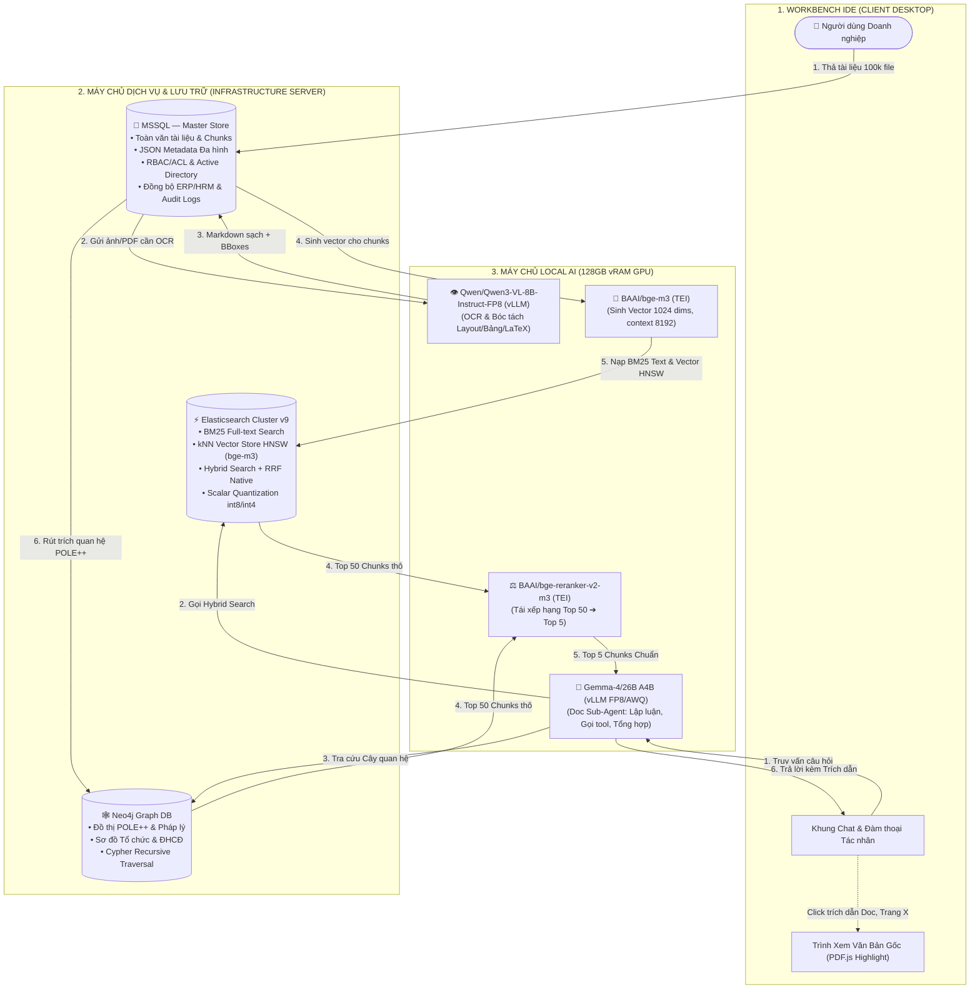
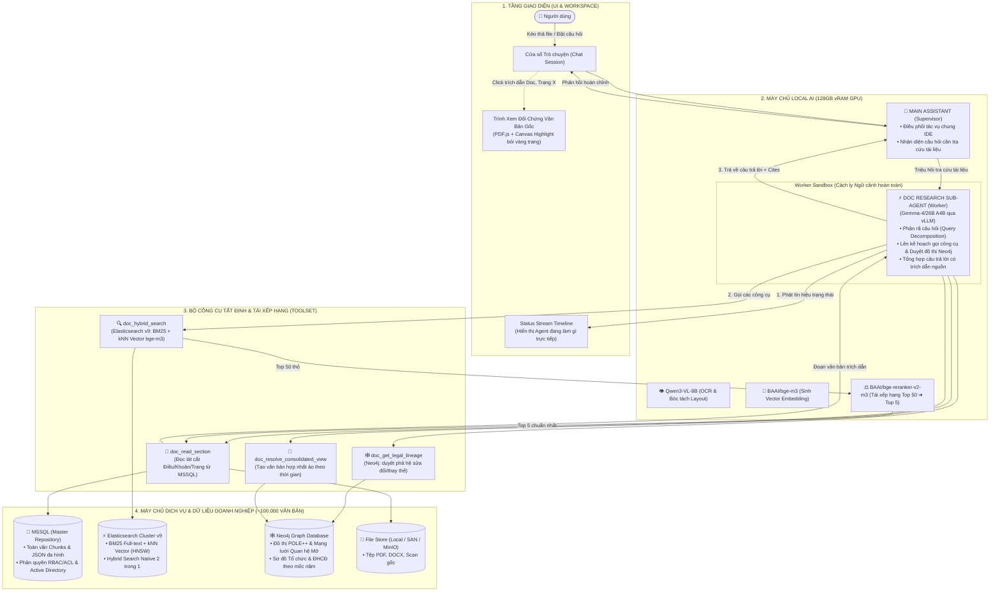
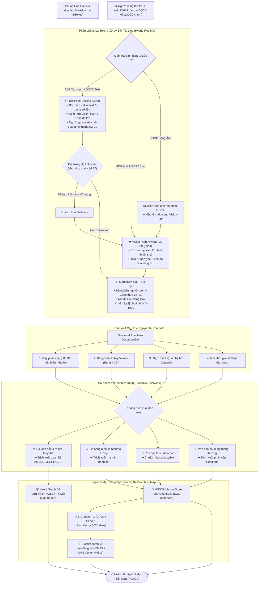
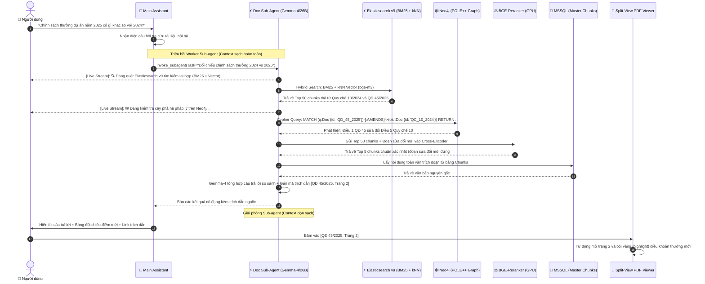
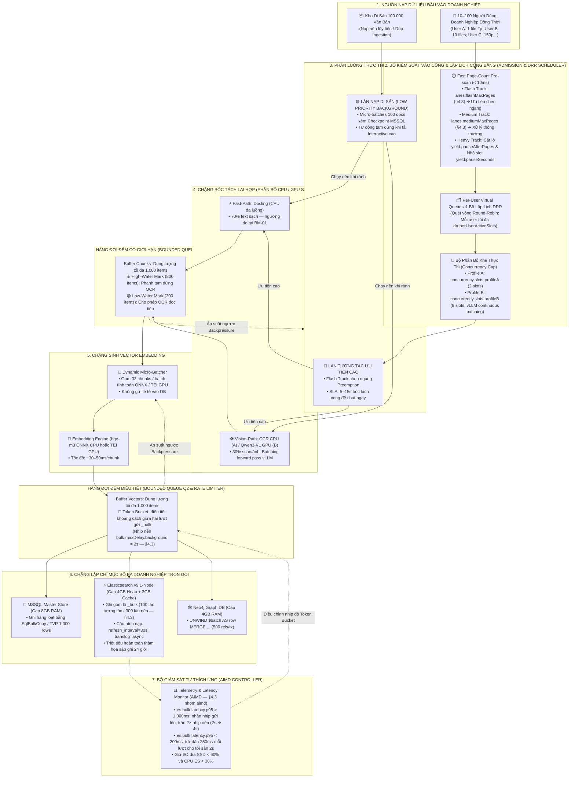
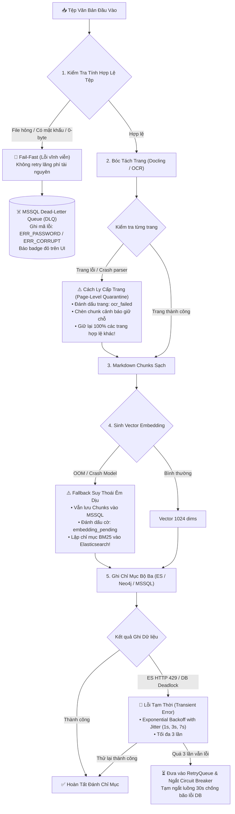
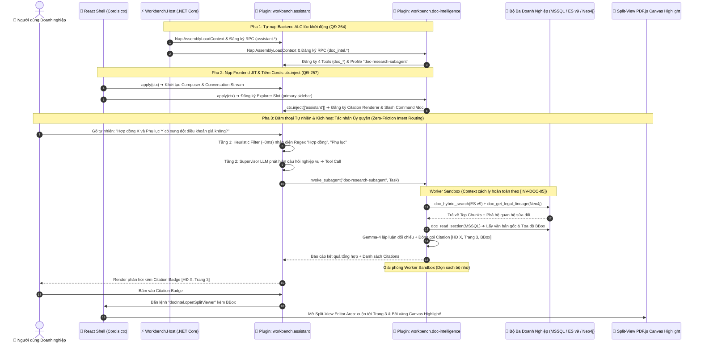
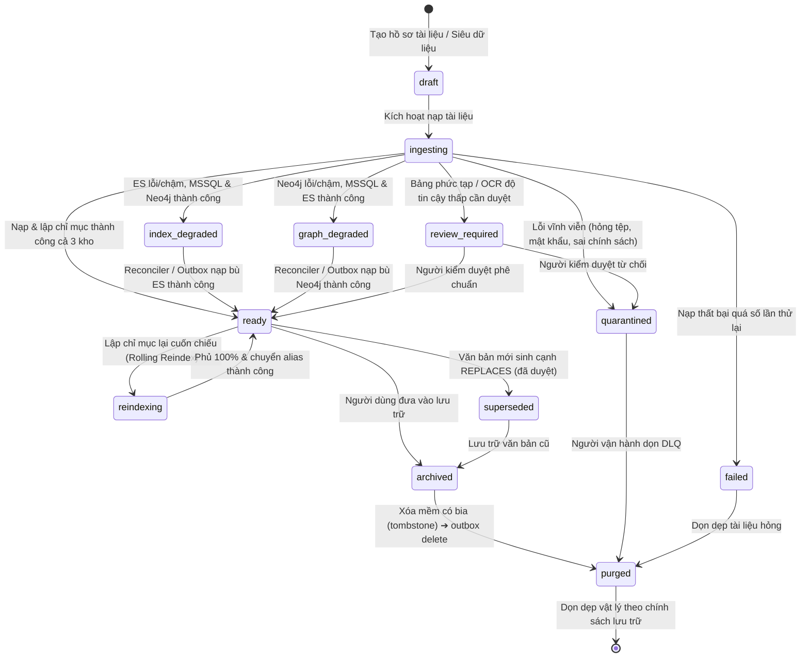
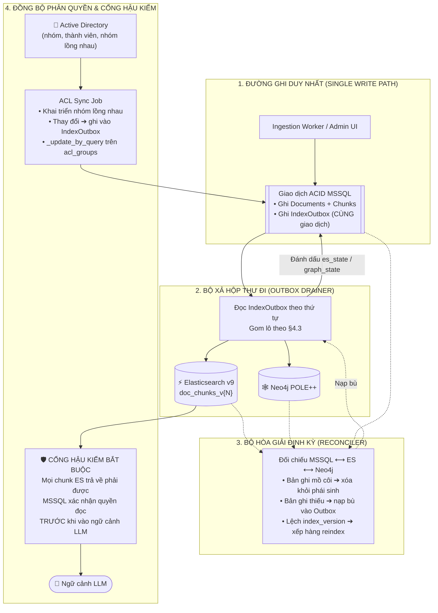

# Feature: Document Intelligence (Agent Khai Thác Tri Thức Tài Liệu Tự Thích Ứng)

> **Trạng thái**: `ACTIVE` — Đặc tả đạt đủ 8 tiêu chí Spec DoD, sẵn sàng cho thi công mã nguồn.  
> **Chủ sở hữu / Phụ trách**: AI Assistant Team & Data Intelligence Architects  
> **Khảo sát kỹ thuật chuyên sâu (Chặng 1)**: [`01-research.md`](01-research.md)  
> **Nguồn nghiên cứu OSS tham chiếu**: [`../../research/sources/enterprise-document-intelligence.md`](../../research/sources/enterprise-document-intelligence.md)  
> **Vị trí mã nguồn (Gói Plugin Hai Đầu `workbench.document-intelligence`)**:
>
> | Layer | Đường dẫn | Trách nhiệm |
> |---|---|---|
> | **Plugin Package Root** | `~/.workbench/plugins/workbench.document-intelligence/` hoặc `resources/plugins/workbench.document-intelligence/` | Gói plugin chuẩn hai đầu (Full-Stack Extension Package), manifest `plugin.json` khai báo dependencies `["workbench.assistant"]` |
> | **React Plugin UI (Frontend)** | `resources/plugins/workbench.document-intelligence/frontend/` | Đăng ký slot Explorer, trình xem Split-View PDF.js + Canvas Highlight BBox; nạp qua Sucrase JIT; đóng góp Citation Renderer & Slash Command `/doc` vào Assistant qua Cordis `ctx.inject(['assistant'])` |
> | **.NET Core Backend (ALC)** | `resources/plugins/workbench.document-intelligence/backend/` (`Workbench.Plugin.DocIntelligence.csproj`) | Nạp vào `AssemblyLoadContext` riêng; đăng ký RPC endpoints (`doc_intel.*`); đăng ký 4 Host Tools (`doc_hybrid_search`, `doc_get_legal_lineage`, `doc_resolve_consolidated_view`, `doc_read_section`) và Sub-Agent Profile `doc-research-subagent` vào Assistant Tool Seam |
> | **Shared Models & Protocol** | `packages/models/doc-intelligence.model.ts` | Zod schemas & TypeScript types: `DocManifest`, `DocChunk`, `Citation`, `IngestionJob`, `QueryResult`, `SubAgentTask`, `GraphEdge`, `OutboxEntry` |

---

## 📑 Mục Lục Điều Hướng Nhanh (Quick Navigation)

- [1. Tầm Nhìn Chiến Lược & Định Vị Sản Phẩm](#1-tầm-nhìn-chiến-lược--định-vị-sản-phẩm)
  - [1.1 Vấn đề thực tế](#11-vấn-đề-thực-tế) · [1.2 Định vị Giải pháp](#12-định-vị-giải-pháp) · [1.3 Ba Tôn Chỉ Thiết Kế & Mô Hình Triển Khai Kép](#13-ba-tôn-chỉ-thiết-kế-tối-thượng--mô-hình-triển-khai-kép-core-design-tenets--dual-profile)
- [2. Mười Nguyên Lý Kiến Trúc Cốt Lõi (Core Principles)](#2-mười-nguyên-lý-kiến-trúc-cốt-lõi-core-principles)
  - [Nguyên lý 7: Kiến Trúc Companion Plugin Hai Đầu & Mối Quan Hệ Phụ Thuộc Vào AI Assistant](#nguyên-lý-7-kiến-trúc-companion-plugin-hai-đầu--mối-quan-hệ-phụ-thuộc-vào-ai-assistant-companion-plugin--agentic-dependency)
  - [Nguyên lý 8: Cắt Lát Bám Cấu Trúc Theo Mô Hình Cha–Con](#nguyên-lý-8-cắt-lát-bám-cấu-trúc-theo-mô-hình-cha–con-structure-aware-parentchild-chunking) · [Nguyên lý 9: Rút Trích Quan Hệ Ba Tầng](#nguyên-lý-9-rút-trích-quan-hệ-ba-tầng--hạng-tin-cậy-của-cạnh-đồ-thị-tiered-relation-extraction--edge-confidence) · [Nguyên lý 10: Chỉ Mục Phái Sinh Tự Hòa Giải](#nguyên-lý-10-chỉ-mục-phái-sinh-tự-hòa-giải--vòng-đời-tài-liệu-trọn-vẹn-self-reconciling-derived-indices--full-document-lifecycle)
- [3. Bản Đồ Quy Trình & Sơ Đồ Kiến Trúc Vận Hành](#3-bản-đồ-quy-trình--sơ-đồ-kiến-trúc-vận-hành-architecture--workflow-diagrams)
  - [3.1 Sơ đồ Vận hành Tổng thể](#31-sơ-đồ-kiến-trúc--luồng-vận-hành-tổng-thể-end-to-end-operational-architecture) · [3.2 Sơ đồ Phân tầng](#32-sơ-đồ-kiến-trúc-phân-tầng--điều-phối-tác-nhân-layered-architecture) · [3.3 Quy trình Ingestion](#33-sơ-đồ-quy-trình-xử-lý-đầu-vào-kéo--thả-zero-config-ingestion-pipeline) · [3.4 Luồng Truy vấn & Suy luận](#34-sơ-đồ-quy-trình-truy-vấn-duyệt-đồ-thị--suy-luận-tác-nhân-query--grounding-flow) · [3.5 Điều phối Đa Làn & Áp Suất Ngược](#35-sơ-đồ-kiến-trúc-điều-phối-đa-làn--áp-suất-ngược-chống-nghẽn-cổ-chai-high-throughput-orchestration--backpressure) · [3.6 Sơ đồ Ứng phó Thất bại & Cách ly Cấp Trang](#36-sơ-đồ-quy-trình-ứng-phó-thất-bại-cách-ly-cấp-trang--phục-hồi-đa-tầng-multi-tier-resilience--fallback-flow) · [3.7 Sơ đồ Khớp Nối Hai Đầu Plugin](#37-sơ-đồ-kiến-trúc-khớp-nối-hai-đầu-plugin-companion-plugin-inter-op-react-cordis--net-alc) · [3.8 Máy Trạng Thái Vòng Đời Tài Liệu](#38-máy-trạng-thái-vòng-đời-tài-liệu--chặng-nạp-có-điểm-kiểm-document-lifecycle--checkpointed-ingestion-state-machine) · [3.9 Hòa Giải Chỉ Mục & Đồng Bộ ACL](#39-hòa-giải-chỉ-mục-phái-sinh--đồng-bộ-phân-quyền-từ-active-directory-outbox-reconciler--acl-propagation)
- [4. Tóm Tắt Danh Mục Công Nghệ & Mô Hình Triển Khai Kép (Definitive Stack & Dual-Profile)](#4-tóm-tắt-danh-mục-công-nghệ-chốt-chính-thức--mô-hình-triển-khai-kép-definitive-technology-stack--dual-profile)
  - [4.3 Bảng Tham Số Vận Hành Chốt Cứng](#43-bảng-tham-số-vận-hành-chốt-cứng-single-source-operational-parameter-table) · [4.4 Ranh Giới Năng Lực & Lộ Trình Di Trú](#44-ranh-giới-năng-lực-giữa-hai-profile--lộ-trình-di-trú-capability-boundary--migration-path) · [4.5 Quan Trắc Vận Hành](#45-quan-trắc-vận-hành--ngưỡng-cảnh-báo-observability-contract)
- [5. Ma Trận Đánh Đổi Kiến Trúc & Căn Cứ Lựa Chọn (Trade-Offs & Rationale)](#5-ma-trận-đánh-đổi-kiến-trúc--căn-cứ-lựa-chọn-trade-offs--architectural-rationale)
- [6. Các Bất Biến Kỹ Thuật Bất Khả Xâm Phạm (System Invariants)](#6-các-bất-biến-kỹ-thuật-bất-khả-xâm-phạm-system-invariants--tiên-đề-cho-ai)
- [7. Phạm Vi Loại Trừ & Điều Cấm Kỵ (Non-Goals & Anti-Patterns)](#7-phạm-vi-loại-trừ--điều-cấm-kỵ-non-goals--anti-patterns)
- [8. Miền Kiểm Chứng Năng Lực & Bộ Đo Nghiệm Thu](#8-miền-kiểm-chứng-năng-lực--bộ-đo-nghiệm-thu-benchmark-domains--acceptance-bar)
  - [8.1 Năm Miền Dữ Liệu Kiểm Chứng](#81-năm-miền-dữ-liệu-kiểm-chứng-thích-ứng) · [8.2 Bộ Đo Nghiệm Thu Định Lượng & Bộ Câu Hỏi Vàng](#82-bộ-đo-nghiệm-thu-định-lượng--bộ-câu-hỏi-vàng-quantitative-acceptance-bar--golden-set)
- [9. Bản Đồ Lộ Trình Triển Khai 6 Chặng Chuẩn (FSP Lifecycle Roadmap)](#9-bản-đồ-lộ-trình-triển-khai-6-chặng-chuẩn-fsp-lifecycle-roadmap)
  - [9.1 Điều Kiện Tiên Quyết Nằm Ngoài Feature Này](#91-điều-kiện-tiên-quyết-nằm-ngoài-feature-này-external-prerequisites) · [9.2 Cổng Chuyển Trạng Thái Của Chính Tài Liệu Này](#92-cổng-chuyển-trạng-thái-của-chính-tài-liệu-này)
- [10. Tài Liệu Tham Chiếu Liên Quan](#10-tài-liệu-tham-chiếu-liên-quan)

---

## 1. Tầm Nhìn Chiến Lược & Định Vị Sản Phẩm

### 1.1 Vấn đề thực tế
Một doanh nghiệp, tổ chức hoặc cá nhân khi tích lũy từ **hàng chục nghìn đến trên 100.000 văn bản** (hợp đồng, quy chế, quyết định pháp lý, hồ sơ dự thầu, tài liệu kỹ thuật, bệnh án y tế, giáo trình đào tạo...) thường đối mặt với 3 bài toán nan giải:
1. **Lãng phí thời gian tra cứu thủ công**: Tìm kiếm tài liệu rải rác mất nhiều giờ, dữ liệu bảng biểu tài chính/kế toán bị cắt vụn khi đưa vào phần mềm tìm kiếm thông thường.
2. **Rủi ro thông tin lỗi thời & thiếu đối chiếu**: Không nhận biết được văn bản/điều khoản cũ đã bị sửa đổi, thay thế hoặc bãi bỏ bởi văn bản mới hơn.
3. **Ảo giác của RAG ngây thơ (Naive RAG)**: Các hệ thống RAG thông thường không hiểu cấu trúc phân cấp, không bắt được số hiệu chính xác, phản hồi chậm và dễ bịa đặt thông tin khi ngữ cảnh bị pha loãng.

### 1.2 Định vị Giải pháp
**Document Intelligence** trong Workbench IDE không đơn thuần là một khung chat hỏi đáp văn bản thông thường, mà được định vị là:
> **Hệ Thống Tác Nhân Khai Thác Tri Thức Tài Liệu Đa Hình & Tự Thích Ứng (Schema-Agnostic & Open-Domain Document Intelligence Agent)** — Có khả năng tiếp nhận bất kỳ loại tài liệu nào, tự động khám phá tri thức, bảo toàn 100% cấu trúc nguyên bản, lập luận liên văn bản và trả lời với độ chính xác tuyệt đối kèm bằng chứng đối chứng trực tiếp trên văn bản gốc.

### 1.3 Ba Tôn Chỉ Thiết Kế Tối Thượng & Mô Hình Triển Khai Kép (Core Design Tenets & Dual-Profile)
Mọi quyết định kiến trúc, lựa chọn thuật toán và triển khai mã nguồn ở tất cả các chặng đều phải tuân thủ 3 tôn chỉ tối thượng sau:
1. 🛡️ **100% On-Premise Air-Gapped First (Bảo Mật Nội Bộ Tuyệt Đối)**:
   - Toàn bộ dữ liệu doanh nghiệp (~100.000 văn bản nhạy cảm), quy trình bóc tách OCR, tính toán vector embedding và lập luận suy luận LLM **bắt buộc chạy 100% nội bộ** trên hạ tầng của khách hàng/doanh nghiệp.
   - Tuyệt đối **không gọi API đám mây công cộng** (OpenAI, Anthropic, Google Cloud) nhằm tuân thủ nghiêm ngặt bảo mật dữ liệu doanh nghiệp và pháp lý.
   - **Mô Hình Triển Khai Kép (Dual Deployment Profile)**:
     - **Profile A (Baseline — Doanh nghiệp Vừa & Nhỏ / Single-Node On-Premise)**: 01 máy chủ vật lý / VM gồm **16 vCPU, 32GB RAM, 1TB NVMe** chạy trọn gói đồng trú (All-in-One: MSSQL 8GB, ES v9 1-node 7GB, Neo4j 4GB, ONNX Runtime CPU int8 3GB). Profile A **lưu trữ và tìm kiếm cục bộ nhưng không tự chạy mô hình tác nhân lõi**: nó trỏ tới một endpoint `openai-compatible` bên ngoài. Hai biến thể Vision-Path (**A1** CPU-only suy giảm có kiểm soát, **A2** kèm 01 GPU 24GB) và điều kiện chuyển sang Profile B chốt tại §4.4. Bóc tách thực tế ~5.000 trang / 1,5–2 giờ, bulk indexing ~15–20 phút, SLA tài liệu tương tác < 15–30s.
     - **Profile B (Scale-Out — Trung tâm Dữ liệu Doanh nghiệp Lớn / AI Cluster)**: Cụm Máy chủ AI GPU chuyên dụng (**128GB vRAM**: Gemma-4/26B A4B, Qwen3-VL-8B, TEI bge-m3) kết hợp Cụm Máy chủ Dữ liệu Doanh nghiệp phân tán (MSSQL Enterprise, Elasticsearch Cluster đa node, Neo4j Enterprise). Phục vụ thông lượng cực đại cho kho hàng trăm nghìn văn bản và hàng nghìn truy vấn đồng thời.
2. 🎯 **Grounding over Fluency (Bằng Chứng Cao Hơn Văn Vẻ)**:
   - Sự thật nguyên bản từ văn bản gốc là tối thượng. Một câu trả lời ngắn gọn, cô đọng kèm số hiệu văn bản và trang bôi vàng có giá trị vô hạn so với một đoạn văn dài dòng, hoa mỹ nhưng thiếu căn cứ xác thực.
   - Thà trả về "Không tìm thấy căn cứ xác thực" (*fail-closed*) còn hơn để AI suy diễn hoặc tự bịa thông tin (*hallucination*).
3. ⚙️ **Determinism over Stochastic Retrieval (Ưu Tiên Tất Định Hơn Đoán Mò)**:
   - Số hiệu văn bản, điều/khoản, ngày ban hành, pháp vực áp dụng và quan hệ hiệu lực pháp lý là dữ liệu có cấu trúc chính xác tuyệt đối.
   - **Tuyệt đối không dùng tìm kiếm vector xác suất** để truy vấn các trường dữ liệu tất định này; bắt buộc sử dụng Full-text BM25, Exact Filter SQL và đồ thị tri thức Cypher.

---

## 2. Mười Nguyên Lý Kiến Trúc Cốt Lõi (Core Principles)

### Nguyên lý 1: Đa hình & Không phụ thuộc Lược đồ (Schema-Agnostic & Open-Domain)
Hệ thống tuyệt đối không gán nhãn cứng hay ép tài liệu vào danh mục đóng. Bất kỳ tài liệu nào (hàng không, xây dựng, luật pháp, y tế, ẩm thực...) đều được phân rã thành **4 Cấu trúc Nguyên tử Phổ quát**:
- **Cây phân cấp nội dung (Hierarchical Tree)**: Headings, Chương, Mục, Điều, Khoản, Quy trình các bước.
- **Bảng biểu & Dữ liệu Cặp (Relational Tables & Key-Values)**: Bảng số liệu, báo cáo tài chính, ma trận thông số.
- **Thực thể & Quan hệ Tự sinh (Open Information Extraction - OpenIE)**: Tự phát hiện các thực thể và mối quan hệ do chính văn bản phát biểu mà không cần định nghĩa trước schema (ví dụ: `[Tua-bin A] -[BẢO DƯỠNG BỞI]-> [Kỹ sư B]`, `[Bản vẽ 04] -[THAY THẾ]-> [Bản vẽ 02]`).
- **Dấu mốc Thời gian & Viện dẫn Chéo (Temporal & Cross-References)**: Mốc ngày hiệu lực, phiên bản, viện dẫn chéo.

### Nguyên lý 2: Trải nghiệm "Kéo & Thả" Hoàn toàn Tự động & Xử Lý Lai Hợp (Zero-Config Hybrid Ingestion)
Người dùng không cần thao tác phân loại thủ công:
- **Xử lý triệt để 3 dạng PDF**:
  - *PDF Text thuần*: Docling bóc tách trực tiếp trên CPU qua Fast-Path, không tốn vRAM GPU. Thông lượng cam kết đo bằng benchmark `BM-01` (§8.2).
  - *PDF Ảnh & **PDF 2 Lớp (Sandwiched PDF)**: **Xem PDF 2 lớp tương đương PDF ảnh** — chủ động bỏ qua (bypass) lớp text ẩn lỗi thời/rác từ máy scan cũ, chuyển toàn bộ ảnh gốc vào `Qwen/Qwen3-VL-8B-Instruct-FP8` để OCR và tái tạo Markdown chuẩn xác 100%.
- **Xử lý DOCX Dạng Ảnh**: Tự động phát hiện các file Word chỉ chứa ảnh chụp văn bản (mật độ text XML thấp nhưng có ảnh nhúng lớn trong `word/media/`) để trích xuất ảnh và chuyển sang Qwen3-VL.
- **Chiến lược Lai hợp Chủ động (Proactive Hybrid)**: Đánh giá độ tinh khiết văn bản (Text Purity Score); tự động kích hoạt Fallback đẩy trang sang Qwen3-VL nếu phát hiện text bị lỗi font, mất dấu hoặc vỡ bảng.

### Nguyên lý 3: Bộ Ba Phần Mềm Doanh Nghiệp "Xương Sống" (The Enterprise Trinity: MSSQL + Elasticsearch v9 + Neo4j)
Tận dụng tối đa và chuyên môn hóa triệt để 3 phần mềm doanh nghiệp sẵn có:
- **MSSQL (Microsoft SQL Server)**: Nguồn Sự Thật Duy Nhất (Master Store) lưu trữ toàn văn tài liệu, các chunks, trường JSON đa hình, quản lý phân quyền RBAC/ACL, tích hợp Active Directory / ERP / HRM và lưu nhật ký kiểm toán (Audit Logs).
- **Elasticsearch v9 (Hybrid Search Engine)**: Đảm nhiệm đồng thời cả **Full-Text BM25** (bắt chính xác 100% số hiệu văn bản, mã điều khoản) và **kNN Dense Vector Indexing (HNSW)** dựa trên model `bge-m3`. Hỗ trợ nén Scalar Quantization (int8/int4) và hợp nhất RRF Native ngay trong cụm Elasticsearch v9, tối ưu bộ nhớ RAM và tốc độ truy vấn.
- **Neo4j (POLE++ & Open Knowledge Graph)**: Đồ thị tri thức chuyên dụng quản lý cây phả hệ pháp lý (`AMENDS`, `REPLACES`, `BASES_ON`), sơ đồ tổ chức ĐHCĐ, tạo **Văn bản hợp nhất ảo (Consolidated View)** và truy vấn quay ngược thời gian (Point-in-Time Queries).

### Nguyên lý 4: Giao diện Split-View & Bảo chứng Tuyệt đối Chống Ảo giác (Strict Grounding)
- Cột trái: Khung hội thoại tương tác với Tác nhân nghiên cứu (**Gemma-4/26B A4B**), stream từng bước xử lý thời gian thực.
- Cột phải: Trình xem văn bản gốc (PDF Viewer qua PDF.js) tự động mở đúng trang và bôi vàng (highlight) dòng văn bản chứa căn cứ trả lời khi người dùng nhấp chuột vào mã trích dẫn.

### Nguyên lý 5: Triết Lý Ứng Phó Thất Bại & Xử Lý Ca Biên (Fail-Closed & Resilience Fallback)
Hệ thống không giả định tỷ lệ thành công 100% mà được thiết kế với cơ chế phòng thủ và phục hồi đa tầng khi gặp sự cố tệp, lỗi lưu trữ hoặc đứt gãy kết nối:
- **Bảo mật & Phân quyền (Fail-Closed)**: Nếu không xác thực được quyền ACL hoặc người dùng không thuộc nhóm quyền đọc văn bản, hệ thống **tuyệt đối không nạp chunk đó vào ngữ cảnh LLM**.
- **Phân Loại Lỗi 2 Nhóm (Transient vs Permanent)**:
  - *Lỗi Tạm Thời (Mạng chập chờn, DB deadlock, ES HTTP 429)*: Tự động thử lại với **Exponential Backoff with Jitter** (thử lại tối đa 3 lần sau 1s, 3s, 7s). Sau 3 lần thất bại sẽ kích hoạt Circuit Breaker tạm ngắt luồng và đưa vào Retry Queue.
  - *Lỗi Vĩnh Viễn (File hỏng magic bytes, PDF đặt mật khẩu, sai định dạng)*: Kích hoạt **Fail-Fast & Cách Ly (Quarantine)** đưa thẳng vào Hàng Đợi Chết (Dead-Letter Queue - DLQ), không retry lãng phí CPU, gắn cờ báo lỗi đỏ trên UI.
- **Cách Ly Lỗi Cấp Độ Trang (Page-Level Quarantine)**: Nếu trang 4 của văn bản 20 trang bị lỗi font, ảnh hỏng làm crash parser $\rightarrow$ Hệ thống đánh dấu riêng trang 4 là `ocr_failed` kèm chunk giữ chỗ cảnh báo, **toàn bộ 19 trang còn lại vẫn được bóc tách, embedding và tìm kiếm bình thường**, không vứt bỏ cả tài liệu.
- **Suy Thoái Êm Dịu Đa Tầng (Multi-Tier Graceful Degradation)**:
  - *Docling lỗi*: Tự động fallback sang Vision-Path OCR.
  - *Embedding lỗi*: Vẫn lập chỉ mục **BM25 Full-text trên Elasticsearch** để tìm kiếm được ngay theo từ khóa, đánh dấu cờ `embedding_pending` để sinh bù vector sau.
  - *Dung lượng đĩa SSD < 5%*: Tự động kích hoạt **Phanh Khẩn Cấp (Emergency Stop)** toàn bộ tiến trình nạp để bảo vệ an toàn dữ liệu cho MSSQL và Elasticsearch.
- **Cảnh báo tính pháp lý & Văn bản lỗi thời**: Khi đồ thị Neo4j chỉ ra văn bản được hỏi đã bị sửa đổi/thay thế bởi văn bản mới hơn, Agent bắt buộc phải xuất cảnh báo hiệu lực đỏ ngay ở đầu phản hồi, trước khi trích dẫn nội dung chi tiết.
- **Phân Hạng Câu Hỏi Quyết Định Hành Vi Suy Thoái (Question Grading — điều kiện của mọi Fallback)**:
  Suy thoái êm dịu là quyền của hạng thông tin, không phải quyền của hạng pháp lý. Mỗi truy vấn được gán đúng một hạng ngay tại cổng vào:
  - *`legal_grade`* — câu hỏi chạm tới hiệu lực, quyền, nghĩa vụ, số tiền, thời hạn, chế tài: nhận diện qua bộ lọc heuristic Tầng 1 (§2 Nguyên lý 7) cộng tuyên bố tường minh của Sub-Agent khi lập kế hoạch. Hạng này **bắt buộc** có kết quả tra cứu phả hệ Neo4j thành công. Neo4j timeout, mất kết nối, hoặc chỉ trả về cạnh `pending_review` $\rightarrow$ **fail-closed**: hệ thống trả về nội dung tìm được kèm tuyên bố *"chưa xác thực được hiệu lực hiện hành"* và **cấm** phát biểu điều khoản đó như quy định đang có hiệu lực.
  - *`informational`* — tra cứu nội dung, tóm tắt, tìm số liệu, hỏi quy trình: được phép suy thoái theo bảng timeout (`01-research.md §5.4`), bỏ qua bước đồ thị và gắn cờ `graph_timeout` vào phản hồi.
  Đây là điều kiện tiên quyết của [`[INV-DOC-06]`](#6-các-bất-biến-kỹ-thuật-bất-khả-xâm-phạm-system-invariants--tiên-đề-cho-ai): bảng timeout mô tả *cách* suy thoái, hạng câu hỏi quyết định *có được phép* suy thoái hay không.

### Nguyên lý 6: Điều Phối Đa Làn Đa Người Dùng, Hàng Đợi Công Bằng Deficit Round-Robin & Áp Suất Ngược (Multi-User Fair-Share Scheduling & Reactive Backpressure)
Trong môi trường doanh nghiệp thực tế với **10–100 người dùng đồng thời (Concurrent Enterprise Users)** (pháp chế, thẩm định, kế toán cùng nạp hồ sơ), hệ thống không thể sử dụng hàng đợi FIFO đơn phẳng vì sẽ gây ra hiện tượng **nghẽn đầu hàng (Head-of-Line Blocking)**, **bỏ đói người dùng (User Starvation)** và **quá tải sập worker (Burst Congestion / OOM)** khi nhiều người cùng kéo thả tài liệu. Hệ thống thiết lập cơ chế điều phối 4 tầng hoàn chỉnh:

1. **Bộ Kiểm Soát Vào Cổng & Phân Hạng Tác Vụ Tức Thì (Admission Gate & Fast Page Pre-scan < 10ms)**:
   Trước khi đưa vào hàng đợi bóc tách, hệ thống quét nhanh header tệp trong `< 10ms` để xác định số trang và phân luồng:
   - *Làn Siêu Tốc (Flash Track — theo ngưỡng `lanes.flashMaxPages` tại §4.3)*: Dành cho hợp đồng ngắn, quyết định, hóa đơn cần hỏi đáp ngay. Làn này được cấp quyền ngắt ưu tiên (*Preemption*) chen ngang tại ranh giới lô, cam kết SLA phản hồi trong **5–15 giây**.
   - *Làn Tiêu Chuẩn (Medium Track — theo ngưỡng `lanes.mediumMaxPages` tại §4.3)*: Xử lý theo thứ tự điều phối, SLA **20–45 giây**.
   - *Làn Cắt Lát Khối Lượng Lớn (Heavy Track — trên `lanes.mediumMaxPages` tại §4.3)*: Tự động chia nhỏ tài liệu thành các khối trang (*Page-Chunks theo `yield.pauseAfterPages` tại §4.3*) và kích hoạt cơ chế **Tự Nguyện Nhượng Bộ (Cooperative Yielding)**: Sau mỗi lô trang, tiến trình tạm dừng nhả slot tài nguyên CPU/GPU trong `yield.pauseSeconds` (§4.3) để nhường đường cho các tệp Flash của người dùng khác.
2. **Hàng Đợi Ảo Theo Người Dùng & Lập Lịch Công Bằng Thâm Hụt (Per-User Virtual Queues & Deficit Round-Robin - DRR)**:
   - Mỗi người dùng/session sở hữu một **Hàng Đợi Ảo (Per-User Virtual Queue)** độc lập, thay vì tranh chấp trên một hàng đợi chung.
   - Bộ lập lịch DRR quét vòng tròn luân phiên giữa các người dùng: Nếu User A nộp 10 file và User B nộp 1 file, Scheduler sẽ phục vụ xen kẽ 1 file của A rồi đến 1 file của B; User B được phục vụ tức thì mà không bao giờ bị nghẽn sau 10 file của User A.
3. **Khống Chế Số Lượng Thực Thi Đồng Thời Cố Định (Concurrency Slots Cap & Per-User Quota)**:
   - *Profile A (16 vCPU, 32GB RAM)*: Khóa cứng tối đa **`concurrency.slots.profileA` slots** (§4.3) đồng thời để bảo vệ CPU/RAM.
   - *Profile B (Scale-Out Enterprise — GPU 128GB vRAM)*: Khóa cứng **`concurrency.slots.profileB` slots** (§4.3, mặc định 8 slots; mở rộng lên 16 theo tài nguyên cụ thể), kết hợp năng lực **Continuous Dynamic Batching** của `vLLM` trên model `Qwen3-VL-8B`: Gom các trang scan từ nhiều người dùng khác nhau vào cùng một forward pass GPU, nâng thông lượng lên mức tối đa mà không gây nghẽn bộ nhớ.
   - *Hạn ngạch người dùng (Per-User Quota)*: Mỗi user tại một thời điểm chỉ được chiếm **tối đa `drr.perUserActiveSlots` active slot** (§4.3). Các tệp tiếp theo của cùng user tự động xếp hàng chờ đến lượt, ngăn chặn hoàn toàn nguy cơ một người dùng spam làm tê liệt toàn bộ hệ thống.
4. **Áp Suất Ngược Phản Ứng & Xả Đệm Lai Hợp 3 Điểm Kích Hoạt**:
   - Các chặng xử lý (Docling/OCR $\rightarrow$ Chunking $\rightarrow$ Embedding $\rightarrow$ Elasticsearch/Neo4j) được phân tách bằng các Bounded Queue lấy tham số từ **Bảng Tham Số Vận Hành Chốt Cứng (§4.3)**: Q1/Q2 sức chứa 1.000 phần tử, High-Water Mark 800, Low-Water Mark 300. Mọi con số hàng đợi trong toàn hệ đặc tả đọc từ đúng bảng đó, không nơi nào khai lại.
   - Ghi vào Elasticsearch v9 qua `_bulk` API theo **Cơ Chế Xả Đệm Lai Hợp 3 Điểm Kích Hoạt** (Kích thước $\ge 100\text{--}300$ chunks HOẶC Timeout 1–2s HOẶC Hết tệp `EndOfDocument`), kết hợp **Token Bucket điều tiết khoảng cách giữa hai lượt gửi** — nhịp nền `bulk.maxDelay.*` (§4.3) do bộ điều khiển AIMD kéo giãn theo hệ số nhân và co lại theo hệ số cộng (nhóm `aimd` tại §4.3) — triệt tiêu hoàn toàn mã lỗi 429 và nghẽn đĩa.
5. **Giám Sát Trạng Thái Hàng Đợi Thời Gian Thực (Real-Time Queue Telemetry)**:
   - Đẩy thông tin vị trí hàng đợi qua WebSocket về UI: *"Bạn đang ở vị trí #2 trong hàng đợi ưu tiên. Ước tính sẵn sàng trong 8 giây..."* kèm tiến trình bóc tách thời gian thực từng trang.

### Nguyên lý 7: Kiến Trúc Companion Plugin Hai Đầu & Mối Quan Hệ Phụ Thuộc Vào AI Assistant (Companion Plugin & Agentic Dependency)
Document Intelligence được thiết kế và triển khai dưới dạng **Companion Plugin (Plugin Vệ Tinh Độc Lập Mở Rộng)** mang định danh **`workbench.document-intelligence`**, phụ thuộc lỏng vào gói plugin cốt lõi **`workbench.assistant`** theo các nguyên tắc:
1. **Tuyệt Đối Không Gộp Chung Thành Monolithic Plugin (Anti-Bloat & SRP)**:
   - `workbench.assistant` chịu trách nhiệm độc quyền về **Trợ lý Lập trình Tự trị (IDE Coding Coworker)**: sinh mã, Monaco Inline Chat (`Cmd+I`), Working Set, sửa lỗi linter/compiler.
   - `workbench.document-intelligence` chịu trách nhiệm về **Khai Thác Tri Thức Tài Liệu Doanh Nghiệp (~100.000 văn bản)**: kết nối bộ ba MSSQL + Elasticsearch v9 + Neo4j, xử lý Ingestion Pipeline lai hợp và Split-View PDF.js Canvas Highlight.
   - Tránh biến Assistant thành khối mã cồng kềnh ép mọi môi trường lập trình nhẹ phải nạp các driver CSDL và mô hình OCR nặng nề.
2. **Bản Chất Phụ Thuộc Vào AI Assistant**:
   - **Tái Sử Dụng Lõi Tác Nhân (Agent Engine Reuse)**: Kế thừa toàn bộ vòng lặp tác nhân đa bước (Step Waterfall Loop), hàng đợi SQLite Event Sourcing, streaming token 60ms và Circuit Breaker của `workbench.assistant`.
   - **Mô hình Supervisor ↔ Worker Sub-Agent (`[INV-DOC-05]`)**: Main Assistant đóng vai trò Supervisor tiếp nhận yêu cầu và điều phối; Document Intelligence đóng vai trò Worker Sub-Agent (`Doc Research Sub-Agent`) thực thi trong Worker Sandbox riêng biệt, trả về kết quả cô đọng kèm danh sách trích dẫn (Citations) rồi giải phóng hoàn toàn bộ nhớ.
   - **Hợp Nhất Trải Nghiệm Đàm Thoại (Unified UX Surface)**: Người dùng chỉ tương tác trên một khung Composer duy nhất của Assistant; không cần mở cửa sổ chat thứ hai.
3. **Cơ Chế Định Tuyến Ý Định Tự Động Hai Tầng (Zero-Friction Intent Routing & Two-Tier Dispatching)**:
   Để loại bỏ hoàn toàn sự bất tiện và phá vỡ thói quen gõ phím tự nhiên của người dùng khi bắt buộc phải gõ `/doc`, hệ thống triển khai cơ chế nhận diện ý định tự động:
   - **Tôn chỉ UX**: Gõ ngôn ngữ tự nhiên (*Natural Prompting*) là **Công Dân Loại Một (First-Class Citizen)** mặc định (chiếm ~95% tương tác). Người dùng chỉ cần gõ câu hỏi thông thường, không cần nhớ bất kỳ cú pháp nào.
   - **Tầng 1 — Bộ Lọc Heuristic Nhanh (Fast-Path Filter — ~0ms CPU)**:
     - Quét nhanh bằng Regex các mẫu số hiệu văn bản: `QĐ \d+`, `Nghị định \d+`, `Thông tư \d+`, `Hợp đồng`, `Phụ lục`, `Điều \d+`, `Khoản \d+`, `SOP`, `Quy chế`, `ĐHCĐ`.
     - Quét từ khóa quan hệ pháp lý / tổ chức: *"sửa đổi"*, *"bãi bỏ"*, *"thay thế"*, *"hiệu lực"*, *"chính sách"*, *"quy định về"*.
     - Tự động ghi một gợi ý `hint: "doc_intelligence"` vào trường `intentHints` của bản ghi `user/message`, rồi chiếu sang khối ngữ cảnh động của lượt hỏi (sau ranh giới cache) mà không tốn token suy luận.
   - **Tầng 2 — Quyết Định Gọi Công Cụ Tự Nhiên Của LLM Supervisor (Native Tool Calling)**:
     - Khai báo năng lực Sub-Agent `doc_research` / `doc-research-subagent` trong **Static Prefix Prompt** của Main Assistant (tận dụng KV-Cache giữ ấm >90%).
     - Khi người dùng hỏi câu hỏi nghiệp vụ, Main LLM tự động nhận diện ý định và phát lệnh `invoke_subagent(name="doc-research-subagent", task=...)` mà không cần người dùng chỉ định thủ công.
   - **Hóa Giải Toàn Diện Bài Toán Tác Vụ Lai Hợp (Hybrid Prompts: Code + Business Documents)**:
     - Hỗ trợ câu hỏi kết hợp giữa lập trình và đối chiếu quy chế doanh nghiệp (ví dụ: *"Hàm tính tiền làm thêm giờ trong `payroll.service.ts` có đang khớp với Điều 6 Quy chế lao động 2025 không?"*).
     - Main Assistant tự động điều phối song song: dùng `read_file` đọc mã nguồn, đồng thời gọi `doc-research-subagent` tra cứu văn bản quy định từ kho tài liệu, sau đó đối chiếu logic và xuất câu trả lời kèm nút mở Split-View PDF.js bôi vàng căn cứ gốc.
   - **Ma Trận Phân Cấp 3 Hình Thức Nhập Liệu**:
     - *1. Gõ tự nhiên (Default)*: Intent Router tự động phân giải và điều phối.
     - *2. Slash Command (`/doc <query>`) — Explicit Override*: Cưỡng chế 100% tra cứu kho tài liệu, bỏ qua bước suy luận của Main Assistant để tăng tốc phản hồi tức thì.
     - *3. Mention Token (`@doc:<doc_id> <query>`) — Context Pinning*: Ghim cứng phạm vi tìm kiếm vào đích danh một văn bản cụ thể trên Elasticsearch và Neo4j.
4. **Khớp Nối Hai Đầu Chuẩn MFA**:
   - *Backend (.NET Core ALC)*: Triển khai class library độc lập `Workbench.Plugin.DocIntelligence.dll`, đăng ký các RPC endpoints riêng (`doc_intel.*`) và đóng góp 4 Host Tools (`doc_hybrid_search`, `doc_get_legal_lineage`, `doc_resolve_consolidated_view`, `doc_read_section`) vào Tool Execution Seam của Assistant.
   - *Frontend (React Shell Cordis Microkernel)*: Sử dụng `ctx.inject(['assistant'])` để đóng góp Custom Node Renderer cho thẻ trích dẫn (`doc-citation`) và đăng ký lệnh mở Split-View PDF Viewer bôi vàng BBox khi nhấp chuột vào citation badge; đồng thời giữ view slot độc lập `workbench.view.doc-intelligence.explorer` ở Sidebar để quản lý kho tài liệu.
5. **Cơ Chế Khớp Nối Lỏng & Suy Thoái Êm Dịu (Loose Coupling & Graceful Degradation)**:
   - Khi chạy độc lập mà không có `workbench.assistant`: Vẫn hoạt động như một Trung tâm Quản trị Tài liệu & Trình xem PDF tìm kiếm truyền thống.
   - Khi có đầy đủ cả hai: Kích hoạt trọn vẹn khả năng Agentic RAG đa tác nhân với trích dẫn đối chứng trực tiếp trên văn bản gốc.

### Nguyên lý 8: Cắt Lát Bám Cấu Trúc Theo Mô Hình Cha–Con (Structure-Aware Parent–Child Chunking)

Chất lượng truy hồi bị quyết định ở bước cắt lát nhiều hơn ở bước chọn mô hình. Hệ thống dùng **mô hình cha–con hai tầng**, tách bạch *đơn vị để tìm* khỏi *đơn vị để đọc*:

- **Chunk Con (`child`, ~150 tokens) — đơn vị được lập chỉ mục.** Vector `bge-m3` và trường BM25 đều gắn vào chunk con. Đoạn ngắn cho vector đặc trưng sắc nét, tránh pha loãng ngữ nghĩa khi một đoạn dài chứa nhiều chủ đề.
- **Chunk Cha (`parent`, ~800 tokens) — đơn vị được nạp vào ngữ cảnh LLM.** Khi một chunk con trúng, hệ thống nạp **chunk cha chứa nó** vào ngữ cảnh, không nạp chunk con. Một Điều/Khoản trọn vẹn luôn nằm trong đúng một chunk cha, nên LLM không bao giờ đọc nửa điều khoản.
- **Ranh giới cắt bám cấu trúc nguyên bản, không bám số ký tự.** Thứ tự ưu tiên khi chọn điểm cắt: ranh giới Điều/Khoản/Mục $\rightarrow$ ranh giới Heading $\rightarrow$ ranh giới đoạn $\rightarrow$ ranh giới câu. **Tuyệt đối cấm** cắt ngang một bảng, một công thức LaTeX, một Điều hoặc một Khoản.
- **Bảng biểu là công dân hạng nhất.** Một bảng luôn là **một chunk cha độc lập**, giữ nguyên cấu trúc hai chiều. Bảng dài vượt ngưỡng chunk cha được cắt theo **nhóm hàng**, và mỗi nhóm hàng **lặp lại dòng tiêu đề cột** — nếu không, một nhóm hàng rời khỏi bảng mẹ là một ma trận số không còn nhãn.
- **Không chồng lấn (`overlap = 0`) giữa các chunk con.** Chồng lấn là cách vá cho mô hình chunking không có tầng cha; ở đây tầng cha đã cung cấp ngữ cảnh bao quanh, nên chồng lấn chỉ làm phình chỉ mục và nhân đôi kết quả trùng.
- **Mỗi chunk mang đường dẫn cấu trúc (`struct_path`)** dạng `Chương II › Điều 5 › Khoản 2`, dùng đồng thời cho lọc tất định, cho hiển thị nguồn trích dẫn và cho công cụ `doc_read_section`.

### Nguyên lý 9: Rút Trích Quan Hệ Ba Tầng & Hạng Tin Cậy Của Cạnh Đồ Thị (Tiered Relation Extraction & Edge Confidence)

Toàn bộ năng lực cảnh báo hiệu lực của sản phẩm đặt trên các cạnh `AMENDS` / `REPLACES` / `ABROGATES` của Neo4j. Một cạnh sai ở đây không tạo ra một câu trả lời hơi lệch — nó tạo ra một câu trả lời **tự tin và sai luật**. Vì vậy cạnh đồ thị không bao giờ được sinh ra bởi một lượt suy luận tự do:

1. **Tầng 1 — Tất định (Deterministic Pattern Matching)**: Bộ luật văn phạm trên các mẫu viện dẫn tiếng Việt (*"sửa đổi, bổ sung Điều X của …"*, *"bãi bỏ …"*, *"thay thế …"*, *"căn cứ …"*, *"hết hiệu lực kể từ …"*). Cạnh sinh ra ở tầng này mang `confidence: deterministic`. Đây là tầng duy nhất được phép chạy một mình.
2. **Tầng 2 — LLM Có Ràng Buộc (Constrained Extraction)**: Chỉ chạy trên **những câu đã được Tầng 1 đánh dấu là câu viện dẫn**, không quét tự do toàn văn. Đầu ra bị ép vào lược đồ JSON đóng với tập quan hệ hữu hạn, và **bắt buộc kèm `evidence_span`** — cặp offset trỏ đúng đoạn chữ trong chunk đã sinh ra cạnh đó. Cạnh không có `evidence_span` hợp lệ bị **loại bỏ tại chỗ**, không ghi vào đồ thị. Cạnh sinh ra ở tầng này mang `confidence: inferred`.
3. **Tầng 3 — Người Duyệt (Human Ratification cho cạnh phá hủy hiệu lực)**: Mọi cạnh `REPLACES` và `ABROGATES` — hai quan hệ duy nhất có thể khiến hệ thống tuyên bố một điều khoản **hết hiệu lực** — vào đồ thị ở trạng thái `pending_review` bất kể sinh ra ở tầng nào. Cạnh `pending_review` được dùng để **cảnh báo** (*"văn bản này có thể đã bị thay thế, cần rà soát"*) nhưng **tuyệt đối không được dùng làm căn cứ khẳng định** một điều khoản đã hết hiệu lực. Màn hình rà soát cạnh nằm trong slot Explorer của plugin.

Hệ quả vận hành: hệ thống **thà cảnh báo thừa còn hơn tuyên bố sai**. Một cạnh chưa duyệt làm người dùng phải tự kiểm tra thêm; một cạnh sai đã duyệt làm người dùng trích dẫn nhầm luật.

### Nguyên lý 10: Chỉ Mục Phái Sinh Tự Hòa Giải & Vòng Đời Tài Liệu Trọn Vẹn (Self-Reconciling Derived Indices & Full Document Lifecycle)

`[INV-DOC-10]` tuyên bố MSSQL là nguồn sự thật duy nhất và ES/Neo4j là chỉ mục phái sinh. Tuyên bố đó chỉ đúng nếu có một cơ chế **bắt buộc** hai chỉ mục phái sinh đuổi kịp bản gốc, kể cả sau khi tiến trình chết giữa chừng:

- **Hộp Thư Đi Giao Dịch (Transactional Outbox)**: Mọi thay đổi tài liệu ghi vào MSSQL **trong cùng một giao dịch** với một bản ghi ý định trên bảng `IndexOutbox`. Không có đường nào ghi thẳng vào Elasticsearch hay Neo4j ngoài đường đọc `IndexOutbox`. Nhờ đó, "đã commit vào master" và "đã có lệnh cập nhật chỉ mục" là **một sự kiện nguyên tử**, không phải hai lượt ghi có thể lệch nhau.
- **Trạng Thái Chỉ Mục Trên Từng Tài Liệu**: Mỗi tài liệu mang `es_state` và `graph_state` (`pending` · `synced` · `failed` · `stale`) cùng `index_version`. Giao diện Explorer hiển thị trực tiếp các cờ này; một tài liệu `synced/failed` là một tài liệu **tìm được toàn văn nhưng chưa có phả hệ**, và hệ thống nói đúng điều đó thay vì im lặng.
- **Bộ Hòa Giải Định Kỳ (Reconciler)**: Quét chênh lệch giữa MSSQL và hai chỉ mục phái sinh theo chu kỳ, dọn bản ghi mồ côi (đã xóa ở master nhưng còn ở ES/Neo4j) và nạp bù bản ghi thiếu. Đây là lưới an toàn cho trường hợp outbox worker chết sau khi ghi ES nhưng trước khi đánh dấu hoàn tất.
- **Vòng Đời Tài Liệu Đầy Đủ**, không chỉ có đường nạp vào: `draft → ingesting → ready → superseded → archived → purged` (cùng các trạng thái suy thoái hoặc rẽ nhánh `index_degraded`, `graph_degraded`, `review_required`, `quarantined`, `reindexing`, `failed`). Xóa là **xóa mềm có bia (tombstone)** (`purged`) trên MSSQL rồi lan qua outbox xuống ES/Neo4j; thay thế một tài liệu bằng bản mới sinh cạnh `REPLACES` và chuyển bản cũ sang `superseded` chứ không xóa — lịch sử hiệu lực là dữ liệu nghiệp vụ, không phải rác.
- **Lập Chỉ Mục Lại Có Kiểm Soát (Rolling Reindex)**: Mỗi chunk mang `embedding_model_id` và `chunk_schema_version`. Đổi mô hình embedding hoặc đổi luật cắt lát **không** xóa chỉ mục cũ: hệ thống dựng chỉ mục mới song song (`doc_chunks_v2`), nạp bù theo lô ở làn nền, rồi chuyển alias khi đã phủ 100%. Kho 100.000 tài liệu không bao giờ có cửa sổ mất khả năng tìm kiếm.

---

## 3. Bản Đồ Quy Trình & Sơ Đồ Kiến Trúc Vận Hành (Architecture & Workflow Diagrams)

### 3.1 Sơ Đồ Kiến Trúc & Luồng Vận Hành Tổng Thể (End-to-End Operational Architecture)

Bức tranh tổng thể mô tả luồng dữ liệu hai chiều giữa Client Desktop, Cụm Máy chủ Dịch vụ & Dữ liệu Doanh nghiệp và Máy chủ Local AI (128GB vRAM GPU) qua cả 2 tiến trình cốt lõi: **(1) Quy trình Nạp & Lập chỉ mục tài liệu (Ingestion Pipeline: Bước 1 ➔ 6)** và **(2) Quy trình Truy vấn & Đối chứng trích dẫn (Query & Grounding Flow: Bước 1 ➔ 6)**:

---

### 3.2 Sơ đồ Kiến trúc Phân tầng & Điều phối Tác nhân (Layered Architecture)

Mô hình phân tầng làm rõ sự phối hợp giữa Assistant tổng, Doc Sub-Agent trên máy chủ AI 128GB vRAM và bộ ba phần mềm doanh nghiệp:

---

### 3.3 Sơ đồ Quy trình Xử lý Đầu vào "Kéo & Thả" (Zero-Config Ingestion Pipeline)

Quy trình nạp tài liệu tự động, đa hình, không phụ thuộc vào việc người dùng phải gán nhãn thủ công:

*Phiên bản v1 hỗ trợ: PDF (3 dạng) và DOCX (kể cả DOCX dạng ảnh). Excel, TXT, EPUB là mục tiêu các phiên bản sau.*

---

### 3.4 Sơ đồ Quy trình Truy vấn, Duyệt Đồ thị & Suy luận Tác nhân (Query & Grounding Flow)

Quy trình tuần tự từng bước từ lúc người dùng đặt câu hỏi đến khi kết quả được hiển thị có trích dẫn đối chứng:

---

### 3.5 Sơ Đồ Kiến Trúc Điều Phối Đa Làn Đa Người Dùng & Áp Suất Ngược Chống Nghẽn Cổ Chai (Multi-User Fair-Share Orchestration & Backpressure)

Để đảm bảo hệ thống vận hành bền bỉ trên **máy chủ tầm trung thực tế (16 vCPU, 32GB RAM, 1TB NVMe - Profile A)** cũng như cụm máy chủ doanh nghiệp phân tán (**Profile B - GPU 128GB vRAM**) khi phục vụ đồng thời **10–100 người dùng doanh nghiệp**, hệ thống giải quyết triệt để 3 bài toán lớn:
1. **Chống Bỏ Đói & Nghẽn Đầu Hàng Đa Người Dùng (Multi-User Fair-Share & Anti-Starvation)**: 10–100 người dùng cùng nạp tài liệu không bị chèn ép lẫn nhau. Triệt tiêu hoàn toàn hiện tượng một người nộp file lớn làm tê liệt toàn bộ hàng đợi thông qua **Hàng Đợi Ảo Theo Người Dùng (Per-User Virtual Queues)** và **Bộ Lập Lịch Công Bằng Thâm Hụt (Deficit Round-Robin - DRR)**.
2. **Kiểm Soát Vào Cổng & Chống Tràn Bộ Nhớ (Dynamic Admission Gate & Concurrency Caps)**: Khống chế số lượng tác vụ bóc tách song song cố định (2 slots trên Profile A; 8–16 slots trên Profile B kết hợp vLLM Continuous Dynamic Batching). Giới hạn hạn ngạch mỗi user chiếm tối đa 1 active slot chống spam/DDOS nội bộ.
3. **Khắc Phục Thảm Họa Spam Sập Elasticsearch (Chống Nghẽn 24 Giờ)**: Bounded Channel + Token Bucket điều tiết khoảng cách giữa hai lượt gửi `_bulk` theo nhịp `bulk.maxDelay.*` (§4.3) dưới quyền bộ điều khiển AIMD + Cơ chế Xả đệm lai hợp 3 điểm kích hoạt.

#### Ma Trận Phục Vụ Cam Kết (SLA) Khi Phục Vụ Đa Người Dùng Đồng Thời:

| Quy mô Người Dùng Đồng Thời | Tình Trạng Tải Trọng | Hành Vi Điều Phối Hàng Đợi | SLA Cam Kết Cho Tài Liệu Mới (Flash Track §4.3) |
|---|---|---|:---:|
| **1 – 5 người dùng** | Tải bình thường (Normal Load) | Cấp slot xử lý ngay; không phải xếp hàng chờ đợi. | **5 – 10 giây** |
| **10 – 30 người dùng** | Tải cao điểm (Peak Hours) | Kích hoạt DRR Round-Robin; mỗi user tối đa 1 active slot; Flash Track chen ngang; tạm dừng nạp nền kho 100k. | **15 – 25 giây** |
| **50 – 100+ người dùng** | Đột biến cực đại (Surge/Burst) | Hàng đợi DRR điều tiết chặt; tệp lớn Heavy tự nguyện nhượng bộ slot sau mỗi lô trang (§4.3); vLLM GPU tận dụng tối đa Continuous Dynamic Batching. | **25 – 45 giây** *(kèm hiển thị số thứ tự hàng đợi trên UI)* |

---

---

### 3.6 Sơ đồ Quy trình Ứng phó Thất bại, Cách ly Cấp Trang & Phục hồi Đa tầng (Multi-Tier Resilience & Fallback Flow)

Hệ thống vận hành thực tế tuyệt đối không giả định tỷ lệ thành công 100%. Quy trình ứng phó thất bại phân loại rạch ròi 2 nhóm lỗi (Transient vs Permanent), cách ly lỗi cấp độ trang (Page-Level Quarantine) và kích hoạt cơ chế suy thoái êm dịu (Graceful Degradation):

---

### 3.7 Sơ Đồ Kiến Trúc Khớp Nối Hai Đầu Plugin (Companion Plugin Inter-Op: React Cordis & .NET ALC)

Sơ đồ mô tả cơ chế bắt tay khởi động theo nguyên lý Host-First ([`QĐ-264`](../../specs/multi-flavor-architecture/03-decisions.md)), quy trình tiêm phụ thuộc lỏng qua Cordis Microkernel ([`QĐ-257`](../../specs/multi-flavor-architecture/03-decisions.md)), và vòng đời ủy quyền tác vụ giữa `workbench.assistant` và `workbench.document-intelligence`:

---

### 3.8 Máy Trạng Thái Vòng Đời Tài Liệu & Chặng Nạp Có Điểm Kiểm (Document Lifecycle & Checkpointed Ingestion State Machine)

Các sơ đồ trên mô tả *dòng chảy*; sơ đồ này mô tả *trạng thái bền vững*. Theo kiến trúc chuẩn hóa tại `05-spec.md §4.3`, hệ thống phân định rạch ròi giữa **Thang trạng thái bền vững cấp Thực thể Tài liệu (`Documents.LifecycleState` — 12 trạng thái chốt cứng)** và **Thang trạng thái tiến trình của từng Lượt nạp (`IngestionJobs.State` — 8 trạng thái)**:

#### 1. Máy trạng thái Vòng đời Thực thể Tài liệu (`Documents.LifecycleState`):

#### 2. Bốn Điểm Kiểm Bền Vững & Tiến Trình Nạp (`IngestionJobs.State` & `LastCheckpoint`):

Theo `QĐ-DOC-019` và `QĐ-DOC-025`, thang trạng thái `IngestionJobs.State` được khoá cứng ở đúng **8 giá trị** (`admitted`, `queued`, `scheduled`, `routing`, `parsing`, `parsed`, `quarantined`, `handoff`). Tiến độ mịn của đường ống nạp được theo dõi độc lập qua cột **`LastCheckpoint VARCHAR(16)`** với đúng 4 điểm kiểm bền vững (mô-đun 01):
1. **Checkpoint 1 (`LastCheckpoint = 'parsed'`)**: Chặng bóc tách chạy trong trạng thái `parsing` ➔ ghi xong dữ liệu trang (`DocumentPages`) thì chuyển sang `parsed`. Trang lỗi lẻ tẻ gắn cờ `ocr_failed`, các trang hợp lệ khác vẫn đi tiếp.
2. **Checkpoint 2 (`LastCheckpoint = 'chunked'`)**: Chặng cắt lát chạy trong trạng thái `parsed` ➔ ghi xong cây phân cấp cha–con (`Chunks`) xuống MSSQL và cập nhật `LastCheckpoint = 'chunked'`.
3. **Checkpoint 3 (`LastCheckpoint = 'embedded'`)**: Chặng sinh vector chạy trong trạng thái `parsed` ➔ ghi xong vector embedding (`ChunkVectors`) xuống MSSQL và cập nhật `LastCheckpoint = 'embedded'`. Nếu mô hình embedding gặp sự cố OOM, hệ thống gắn cờ `embedding_pending` và chỉ chuyển tiếp chỉ mục BM25.
4. **Checkpoint 4 (`LastCheckpoint = 'indexed'`)**: Chặng chỉ mục chạy trong trạng thái `parsed` ➔ ghi xong lệnh đẩy vào Transactional Outbox (`IndexOutbox`), cập nhật `LastCheckpoint = 'indexed'` và đồng thời chuyển trạng thái lượt nạp sang `handoff`, sẵn sàng xả xuống Elasticsearch và Neo4j.

**Khởi động lại sau sự cố, tiến trình đọc trạng thái trên đĩa và chạy tiếp từ chặng kế tiếp**, không bao giờ làm lại từ đầu: đã qua checkpoint 2 thì không bóc tách lại, đã qua checkpoint 3 thì không tính lại vector. Mỗi chặng ghi kèm `attempt_count` bền vững trong CSDL (trần 3 lượt thử áp dụng cho toàn bộ lượt nạp theo `QĐ-DOC-025`).

**Các trạng thái chấp nhận suy giảm có tên gọi riêng**, vì một tài liệu nửa vời phải nói được nó thiếu cái gì: `index_degraded` (có trong master, thiếu Elasticsearch), `graph_degraded` (có trong master, thiếu Neo4j) khác hẳn `ready` kèm `embedding_pending` (tìm được bằng BM25, chưa tìm được bằng ngữ nghĩa). Gộp cả hai thành "lỗi" là xóa mất thông tin mà người vận hành cần để quyết định.

---

### 3.9 Hòa Giải Chỉ Mục Phái Sinh & Đồng Bộ Phân Quyền Từ Active Directory (Outbox, Reconciler & ACL Propagation)

Hai đường ghi nguy hiểm nhất của hệ thống đều đi qua sơ đồ này: đường lan truyền **nội dung** xuống hai chỉ mục phái sinh, và đường lan truyền **quyền đọc** từ Active Directory xuống bộ lọc của Elasticsearch.

**Vì sao phải có cổng hậu kiểm dù `acl_groups` đã nằm trong chỉ mục.** Bộ lọc ACL trên Elasticsearch là bản sao của sự thật, và bản sao thì trễ: một người vừa bị gỡ khỏi nhóm vẫn khớp bộ lọc cũ cho tới khi `_update_by_query` chạy xong trên toàn bộ chunk của kho. Lọc trước tại ES là **tối ưu hiệu năng** (cắt 99% kết quả ngay ở tầng tìm kiếm); xác nhận lại tại MSSQL là **ranh giới bảo mật thật**. Bỏ vế thứ hai thì độ trễ đồng bộ của một job nền trở thành cửa sổ rò rỉ dữ liệu mật — và đó chính xác là điều `[INV-DOC-03]` cấm.

**Ngân sách trễ đồng bộ ACL** chốt tại §4.3. Vượt ngân sách, ACL Sync Job phát cảnh báo vận hành; nó **không** làm dừng hệ thống, vì cổng hậu kiểm vẫn đang giữ đúng ranh giới.

---

## 4. Tóm Tắt Danh Mục Công Nghệ Chốt Chính Thức & Mô Hình Triển Khai Kép (Definitive Technology Stack & Dual-Profile)

Hệ thống hỗ trợ 2 mô hình triển khai linh hoạt theo quy mô và năng lực hạ tầng phần cứng của doanh nghiệp:

### 4.1 Bảng So Sánh Hai Mô Hình Triển Khai (Profile Comparison Matrix)

| Hạng Mục Kiến Trúc | Profile A: Baseline (Doanh nghiệp Vừa / Single-Node) | Profile B: Scale-Out (Enterprise AI Datacenter) |
|---|---|---|
| **Cấu Hình Phần Cứng** | **01 Máy chủ vật lý / VM**: 16 vCPU, 32GB RAM, 1TB NVMe SSD | **Cụm Máy chủ AI (GPU 128GB vRAM)** + **Cụm Máy chủ Dữ liệu Doanh nghiệp** |
| **Bóc Tách & OCR** | Docling CPU Fast-Path + Vision-Path theo biến thể: **A1** OCR CPU đa luồng (6 cores, suy giảm có kiểm soát) · **A2** `Qwen3-VL-8B` AWQ int4 trên 01 GPU 24GB — xem §4.4 | Docling CPU Fast-Path + **Qwen/Qwen3-VL-8B-Instruct-FP8 (GPU vLLM bfloat16)** |
| **Mô Hình Embedding** | **BAAI/bge-m3 int8 qua ONNX Runtime CPU** (2 cores, ~30–50ms/chunk) — **cùng 1024 dims với Profile B** | **BAAI/bge-m3 qua HuggingFace TEI (GPU)** (batch 64 chunks, throughput cực đại) |
| **Mô Hình Tác Nhân Lõi** | **Không chạy cục bộ.** Trỏ tới một endpoint `openai-compatible` nằm ngoài máy chủ Profile A (máy chủ AI dùng chung hoặc VM GPU riêng) — xem §4.4 | **Gemma-4/26B A4B (vLLM FP8/AWQ)** chạy trực tiếp trên GPU 128GB vRAM |
| **Mô Hình Reranker** | **RRF native của Elasticsearch v9** — không chạy cross-encoder trên CPU (§4.4) | **BAAI/bge-reranker-v2-m3 qua HuggingFace TEI (GPU)** |
| **Elasticsearch v9** | 1 Node All-in-One (Cap 4GB Heap + 3GB OS Cache, 4 vCPU) | Cluster đa Node phân tán (Master, Data, Ingest Nodes chuyên biệt) |
| **MSSQL Server** | Cài đặt cục bộ (Cap `max server memory` = 8GB RAM, 2 vCPU) | Cụm MSSQL Enterprise Always On Availability Groups |
| **Neo4j Graph DB** | Cài đặt cục bộ (Cap `heap` 2GB + `pagecache` 2GB = 4GB RAM) | Cụm Neo4j Enterprise Causal Clustering |
| **Quy Mô Phù Hợp** | 1.000 – 20.000 tài liệu (kho di sản nạp nền 1–3 ngày; tài liệu mới < 30s) | 100.000 – 1.000.000+ tài liệu, phục vụ đồng thời hàng trăm người dùng |

### 4.2 Chi Tiết Chức Năng Từng Tầng Công Nghệ

Chi tiết khảo sát và phân bổ tài nguyên vRAM được lưu tại [`01-research.md`](01-research.md):

* **Tầng 1 — Bóc tách Layout & OCR**: **Qwen/Qwen3-VL-8B-Instruct-FP8** kết hợp **Docling** (chạy GPU vLLM trên Máy chủ AI ở Profile B, hoặc Docling + OCR CPU đa luồng ở Profile A). Tích hợp kiến trúc MRoPE 3D phân giải đa trang, xuất tọa độ hình học `[x1, y1, x2, y2]` chuẩn hóa 0–1000 phục vụ Canvas Highlight, trích xuất bảng biểu kế toán và công thức toán/lý/hóa LaTeX.
* **Tầng 2 — Đồ thị Tri thức (POLE++ & Open Graph)**: **Neo4j Enterprise / Community** (truy vấn Cypher đệ quy quản lý quan hệ sửa đổi, bãi bỏ, thay thế và sơ đồ tổ chức).
* **Tầng 3 & 4 — Tìm kiếm Lai hợp (Hybrid Search)**: **Elasticsearch v9** gánh đồng thời **BM25 Full-text** và **kNN Dense Vector Indexing (HNSW)** với tối ưu hóa Scalar Quantization (int8/int4) và RRF native.
* **Tầng 5 — Mô hình Embedding**: **BAAI/bge-m3** (chạy HuggingFace TEI GPU trên Profile B, hoặc ONNX Runtime CPU int8 trên Profile A; 1024 dimensions, context 8.192).
* **Tầng 6 — Tái xếp hạng (Cross-Encoder Reranker)**: **BAAI/bge-reranker-v2-m3** (chạy HuggingFace TEI GPU trên Profile B, hoặc RRF native trên Profile A).
* **Tầng 7 — Tác nhân Lập luận Lõi (Agent Model)**: **Gemma-4/26B A4B** (chạy vLLM FP8/AWQ trên Máy chủ AI 128GB vRAM).
* **Tầng 8 — Master Data & Quản trị RBAC/ACL**: **MSSQL (Microsoft SQL Server)** làm Master Repository lưu trữ Chunks, metadata JSON đa hình, phân quyền RBAC/ACL và kiểm toán tuân thủ.
* **Tầng 9 — Giao diện Đối chứng (Viewer UI)**: **PDF.js** + Canvas Highlight Layer + `@workbench/ui` (Split-View 2 cột).

---

### 4.3 Bảng Tham Số Vận Hành Chốt Cứng (Single-Source Operational Parameter Table)

Đây là **nơi duy nhất** khai giá trị của các tham số vận hành. Mọi sơ đồ, bất biến, mô-đun và mã nguồn đọc số từ bảng này; tuyệt đối cấm khai lại một con số ở chỗ thứ hai — một tham số có hai nguồn là một tham số sẽ lệch ngay lần đầu có người chỉnh.

| Nhóm | Tham số | Giá trị chốt | Vì sao là giá trị này |
|---|---|:---:|---|
| **Phân làn** | `lanes.flashMaxPages` | **5** | Ngưỡng trang tối đa của làn Flash (1–5 trang); ưu tiên ngắt ranh giới lô |
| | `lanes.mediumMaxPages` | **20** | Ngưỡng trang tối đa của làn Medium (6–20 trang); trên ngưỡng này là làn Heavy |
| **Bóc tách & Định tuyến** | `routing.bitmapCoverageRatio` | **0.80** | Ngưỡng diện tích vùng ảnh phủ trang để nhận diện PDF ảnh hoặc PDF hai lớp (`modules/01 §4.1`, `[INV-DOC-04]`) |
| | `routing.docxMinWordsPerPage` | **50 từ/trang** | Ngưỡng mật độ từ tối thiểu trên trang DOCX; dưới ngưỡng kích hoạt trích ảnh nhúng (`[INV-DOC-07]`) |
| | `routing.docxWordsPerPage` | **500 từ/trang** | **Hệ số quy đổi** số trang của một gói DOCX chưa dàn trang: `pageCount = max(1, ceil(wordCount / 500))`. Đây là mật độ điển hình của một trang A4 dãn đơn 12pt, và nó là một tham số KHÁC hẳn `routing.docxMinWordsPerPage`: dùng chính cái sàn làm số chia khoá cứng mật độ quy đổi vào đúng giá trị sàn và làm nhánh nhận diện DOCX dạng ảnh mất năng lực phân biệt (`modules/01 §4.1`, `QĐ-DOC-035`) |
| | `purity.minScore` | **0.85** | Ngưỡng điểm tinh khiết tối thiểu (tích 3 thành phần) cho Fast-Path (`modules/01 §4.2`, `[INV-DOC-08]`) |
| | `purity.maxGarbageCharRatio` | **0.01** (1%) | Ngưỡng tỷ lệ ký tự rác trần (`\ufffd` và ký tự điều khiển); vượt ngưỡng lập tức fallback (`[INV-DOC-08]`) |
| | `purity.minLexicalTokens` | **20 tokens** | Số lượng token âm tiết tối thiểu để áp dụng kiểm tra từ vựng, tránh phạt oan bảng số (`QĐ-DOC-021`) |
| | `vision.variant` | **`"A1"`** | Biến thể Vision-Path mặc định trên Profile A (`"A1"` CPU OCR; `"A2"` GPU Qwen3-VL; `"B"` vLLM GPU — `QĐ-DOC-012`) |
| **Cắt lát** | `chunk.child.tokens` | **150** | Tokens tối đa của chunk con; đủ ngắn để vector không bị pha loãng đa chủ đề (`modules/07 §4.3`) |
| | `chunk.parent.tokens` | **800** | Ngưỡng tokens tiêu chuẩn của chunk cha; đủ chứa trọn một Điều/Khoản điển hình (`modules/07 §4.3`) |
| | `chunk.overlap` | **0** | Độ chồng lấn giữa các chunk con; bằng 0 vì tầng cha đã cấp ngữ cảnh bao quanh (`QĐ-DOC-007`) |
| **Hàng đợi** | `queue.Q1.capacity` (Parse ➔ Embed) | **1.000** | Ngân sách RAM worker 3GB ở Profile A |
| | `queue.Q2.capacity` (Embed ➔ Index) | **1.000** | — |
| | `queue.highWaterMark` | **800** (80%) | Phanh nguồn nạp trước khi chạm trần, không phanh khi đã tràn |
| | `queue.lowWaterMark` | **300** (30%) | Trễ đủ rộng để không rung phanh liên tục (hysteresis) |
| **Xả đệm & Gom lô** | `bulk.maxBatch.interactive` | **100 chunks** | Làn tương tác đổi thông lượng lấy độ trễ (cấu hình thể hiện bộ xả; không ánh xạ sang ba làn nạp `flash`/`medium`/`heavy` — `QĐ-DOC-024`) |
| | `bulk.maxBatch.background` | **300 chunks** | Làn nền đổi độ trễ lấy thông lượng; bộ xả mặc định của gói plugin chạy ở làn này (`QĐ-DOC-024`) |
| | `bulk.maxDelay.interactive` | **500 ms** | Điểm kích hoạt thời hạn của `[INV-DOC-13]` cho làn tương tác; thời hạn xả tối đa dùng chung cho cả bộ gom lô sinh vector (`MicroBatcher`) và bộ xả đệm chỉ mục (`_bulk`) (`QĐ-DOC-023`) |
| | `bulk.maxDelay.background` | **2 s** | Điểm kích hoạt thời hạn của `[INV-DOC-13]` cho làn nền; thời hạn xả tối đa dùng chung cho cả bộ gom lô sinh vector (`MicroBatcher`) và bộ xả đệm chỉ mục (`_bulk`) (`QĐ-DOC-023`) |
| **Tự thích ứng** | `aimd.latencyTriggerMs` | **1.000 ms** | Mốc phân vị 95 của độ trễ `_bulk` kích hoạt pha giãn nhịp (`§4.5`, `QĐ-DOC-045`) |
| | `aimd.latencyRecoveryMs` | **200 ms** | Mốc độ trễ nằm dưới đó mới hồi nhịp; khoảng hở giữa hai mốc là vùng chết giữ nhịp khỏi nhảy qua nhảy lại mỗi lượt quan sát (`01-research.md §4`, `QĐ-DOC-045`) |
| | `aimd.backoffMultiplier` | **2** | Hệ số **nhân** của pha giãn — buông tải nhanh khi cụm quá tải (`QĐ-DOC-045`) |
| | `aimd.maxBackoffFactor` | **2** | Trần nhịp khai theo **bội số** của `bulk.maxDelay.background`, cho ra trần 4 s trên nhịp nền 2 s và tự đi theo nhịp nền khi có người chỉnh bảng này (`§3.5`, `QĐ-DOC-045`) |
| | `aimd.recoveryStepMs` | **250 ms** | Bậc **cộng** của pha hồi — nạp tải chậm: đi từ trần 4 s về sàn 2 s đòi 8 lượt quan sát tốt liên tiếp (`QĐ-DOC-045`) |
| **Embedding** | `embed.batchSize.cpu` | **32 chunks** | Ngưỡng trần tối ưu trên CPU 2 cores (~1,5s/nhịp) — kích thước lô bộ gom `MicroBatcher` (`QĐ-DOC-011`, `QĐ-DOC-020`) |
| | `embed.batchSize.gpu` | **64 chunks** | Bão hòa TEI trên GPU — kích thước lô bộ gom `MicroBatcher` |
| | `embed.model` | **`BAAI/bge-m3`** | Một mô hình cho **cả hai Profile** — cùng 1024 dims, chỉ mục di trú được |
| | `embed.dims` | **1024** | Khớp `doc_chunks_v1` (`01-research.md §5.3`) |
| **Điều phối** | `drr.quantum` | **10 trang** | Hạn mức trang cấp cho mỗi vòng quét (đơn vị: trang/vòng) |
| | `drr.perUserActiveSlots` | **1** | Chống độc chiếm (`[INV-DOC-12]`) |
| | `concurrency.slots.profileA` | **2** | Bảo vệ 16 vCPU đồng trú |
| | `concurrency.slots.profileB` | **8** | Cận dưới an toàn chống tranh chấp vRAM; nâng lên 16 theo cấu hình cụ thể |
| | `yield.pauseAfterPages` | **10 trang** | Độ dài một lô trang của làn Heavy trước khi nhượng bộ |
| | `yield.pauseSeconds` | **2 s** | Thời gian tạm dừng nhả slot sau mỗi lô của làn Heavy |
| **Truy hồi** | `retrieval.topK.raw` | **50 chunks con** | Đầu vào của reranker |
| | `retrieval.topK.final` | **5 chunk cha** | Đầu vào ngữ cảnh LLM — nạp **cha**, không nạp con |
| **Bền bỉ** | `retry.backoff` | **1s · 3s · 7s** (kèm jitter) | Tối đa 3 lần rồi ngắt Circuit Breaker |
| | `circuitBreaker.openDuration` | **30 s** | Chống bão lỗi CSDL |
| | `disk.emergencyStopFreeRatio` | **0.05** | Phanh khẩn cấp bảo vệ MSSQL/ES (`freeRatio < threshold`, dừng nạp nhưng bảo toàn hàng đợi) (`QĐ-DOC-025`) |
| **Phân quyền** | `acl.syncIntervalMinutes` | **2** | Nhịp chạy một vòng đồng bộ AD; nhỏ hơn hẳn ngân sách trễ để một vòng lỡ vẫn còn dư địa trước khi chạm ngưỡng cảnh báo (`modules/05 §4.1`, `QĐ-DOC-042`) |
| | `acl.syncBudgetMinutes` | **5** | Ngân sách trễ lan truyền từ AD; vượt ngưỡng phát cảnh báo, **không** dừng hệ thống vì cổng hậu kiểm vẫn giữ ranh giới (`QĐ-DOC-042`) |
| | `acl.maxExpansionDepth` | **16** | Trần số tầng lồng nhau của phép khai triển nhóm AD; chạm trần ghi cảnh báo cấu hình và dừng nhánh đó, chặn đứng vòng lặp nhóm (`modules/05 §4.1`, `QĐ-DOC-042`) |
| **Hòa giải** | `reconciler.interval` | **15 phút** | Lưới an toàn cho outbox drainer chết giữa chừng |

> [!IMPORTANT]
> **Ràng buộc cấu trúc về độ mịn ngắt ưu tiên & Chính sách bảng biểu**:  
> - **Độ mịn ngắt ưu tiên (Preemption Granularity)**: Quyền ngắt ưu tiên của làn Flash và nhượng bộ của làn Heavy **bắt buộc neo tại ranh giới lô trang** (giữa hai lần gọi `TryDispatch()`). vLLM không hỗ trợ trục xuất request đang trong forward pass GPU; do đó đây là **bất biến kiến trúc của mã nguồn**, không phải một tham số có thể cấu hình được qua tệp JSON.
> - **Chính sách cắt lát bảng biểu (Table Chunking Policy)**: Quy tắc cắt lát bảng biểu (`1 bảng = 1 chunk cha`; bảng dài không ô gộp cắt theo nhóm hàng và lặp lại dòng tiêu đề cột; bảng có ô gộp dọc `rowspan` giữ nguyên khối cho phép vượt ngưỡng tokens) là **luật cấu trúc bất biến kiểm tra được của mã nguồn (`[INV-DOC-16]`, `TableHandler.cs`, `QĐ-DOC-022`)**, không phải tham số JSON trong `operational-parameters.json`. Tệp cấu hình vận hành chỉ chứa bộ ba tham số số học: `chunk.parent.tokens`, `chunk.child.tokens` và `chunk.overlap`.
> - **Cổng hậu kiểm phân quyền (ACL Post-Check)**: Phép xác nhận lại quyền tại MSSQL sau khi Elasticsearch trả kết quả (§3.9, `[INV-DOC-03]`) là **ranh giới bảo mật bất biến của mã nguồn**, chạy trên mọi lượt truy hồi và không có khoá cấu hình nào tắt được nó. Nó không phải một tham số trong `operational-parameters.json`; nhóm `acl` của tệp đó chỉ chứa bộ ba tham số số học: `acl.syncIntervalMinutes`, `acl.syncBudgetMinutes` và `acl.maxExpansionDepth`.
> - **Cổng ẩn danh hóa PII/PHI**: Tập hai miền bị che (`medical`, `hr`) là **hằng số của mã nguồn** (`modules/05 §4.7.1`, `QĐ-DOC-043`), **không** có nhóm `pii` trong `operational-parameters.json`. Một khóa JSON ở đây vừa dựng nguồn thứ hai cho một giá trị đã nằm trong đặc tả, vừa cho phép tắt một cổng bảo mật bằng cấu hình. Miền của **một tài liệu cụ thể** là dữ liệu, khai ở `Documents.Attributes` ▸ `dataDomain`; cột khuyết hoặc méo đọc ra thành "không che" chứ không thành ngoại lệ chặn đứng lượt nạp.
> - **Bộ điều tiết nhịp gửi `_bulk` không có khóa tốc độ riêng**: đại lượng bị điều khiển của bộ điều tiết (Token Bucket ở §3.5) là **khoảng cách giữa hai lượt gửi `_bulk`**, khai bằng cặp `bulk.maxBatch.*` và `bulk.maxDelay.*` và được nhóm `aimd` kéo giãn hay co lại theo độ trễ đo được. Một khóa tốc độ tính bằng `docs/s` đứng cạnh cặp ấy là bộ điều tiết thứ hai trên cùng một đường ống, ràng buộc lỏng hơn hẳn cặp đã có nên không bao giờ chạm, và là đúng dạng nguồn thứ hai mà bảng này sinh ra để chặn (`QĐ-DOC-045`).
> - **Tham số triển khai không nằm trong bảng này**: Profile triển khai (`deploymentProfile` ∈ {`A`, `B`}, mặc định `A`) và địa chỉ endpoint mô hình sinh vector (`embeddingEndpoint`) là thuộc tính của **một bản cài đặt**, không phải ngưỡng nghiệp vụ dùng chung. Cả hai đọc từ `StoreConnectionSettings` đi cùng đường với ba chuỗi kết nối kho dữ liệu (`modules/01 §4.6`, `QĐ-DOC-035`). Profile quyết định chọn `embed.batchSize.cpu` hay `embed.batchSize.gpu` của bảng trên; `embeddingEndpoint` vắng mặt cho ra lượt suy thoái `embedding_pending` của §3.8 chứ không cho ra một vector 0.

### 4.4 Ranh Giới Năng Lực Giữa Hai Profile & Lộ Trình Di Trú (Capability Boundary & Migration Path)

Hai Profile **không** là hai mức cấu hình của cùng một năng lực; chúng là hai mức năng lực khác nhau, và tài liệu này nói thẳng khác ở đâu để người mua không kỳ vọng nhầm.

| Năng lực | Profile A1 (CPU-only) | Profile A2 (+1 GPU 24GB) | Profile B (128GB vRAM) |
|---|:---:|:---:|:---:|
| Tìm kiếm lai hợp BM25 + kNN | ✅ Đầy đủ | ✅ Đầy đủ | ✅ Đầy đủ |
| Đồ thị phả hệ & cảnh báo hiệu lực | ✅ Đầy đủ | ✅ Đầy đủ | ✅ Đầy đủ |
| Bóc tách PDF text thuần (Fast-Path) | ✅ Đầy đủ | ✅ Đầy đủ | ✅ Đầy đủ |
| Bóc tách PDF ảnh / PDF 2 lớp | ⚠️ OCR CPU: BBox cấp dòng, **bảng phức tạp gắn cờ `low_fidelity_table`** | ✅ Qwen3-VL AWQ int4 | ✅ Qwen3-VL FP8 |
| Tái xếp hạng Cross-Encoder | ❌ Thay bằng **RRF native** của ES v9 | ❌ Thay bằng RRF native | ✅ BAAI/bge-reranker-v2-m3 |
| Mô hình tác nhân lõi | 🔗 Endpoint `openai-compatible` bên ngoài | 🔗 Endpoint bên ngoài | ✅ Gemma-4/26B A4B cục bộ |
| Quy mô khuyến nghị | 1.000–20.000 tài liệu | 1.000–20.000 tài liệu | 100.000–1.000.000+ |

**Ba tuyên bố dứt khoát về Profile A:**

1. **Profile A không tự chạy mô hình tác nhân lõi.** Một máy 32GB RAM không GPU không chạy được mô hình 26B, và viết ngược lại là bán một lời hứa không giữ được. Profile A **bắt buộc** khai một endpoint `openai-compatible` trong cấu hình kết nối — có thể là máy chủ AI dùng chung của doanh nghiệp, một VM GPU riêng, hoặc chính cụm Profile B của một chi nhánh khác. Đây cũng là lý do lớp nối mô hình dùng đúng lược đồ `openai-compatible` mà `workbench.assistant` đã hiện thực, không sinh thêm một giao thức thứ hai.
2. **Profile A1 suy giảm có kiểm soát, không suy giảm im lặng.** `[INV-DOC-04]` bắt buộc **bypass lớp text ẩn và đi Vision-Path** — luật này áp cho cả A1. Điều A1 không làm được là *chất lượng* của Vision-Path: OCR CPU cho BBox cấp dòng thay vì cấp ô, và bảng không viền thì gắn cờ `low_fidelity_table`. Cờ này đi kèm mọi trích dẫn rút ra từ bảng đó, nên người dùng luôn biết mình đang đọc một bảng chưa được bảo chứng.
3. **Di trú A → B không cần dựng lại kho.** Cả hai Profile dùng **cùng `bge-m3`, cùng 1024 dims, cùng lược đồ `doc_chunks_v{N}`**, nên nâng cấp hạ tầng là đổi điểm cuối dịch vụ, không phải nhập lại dữ liệu. Thứ **cần** chạy lại là Vision-Path cho các tài liệu mang cờ `low_fidelity_table` hoặc `ocr_failed` — hệ thống liệt kê sẵn danh sách này và nạp lại chúng ở làn nền theo cơ chế Rolling Reindex (Nguyên lý 10). Đây là lý do `bge-small` bị loại khỏi hệ đặc tả: 384 dims sẽ khóa cứng Profile A vào một chỉ mục không bao giờ di trú được sang Profile B.

### 4.5 Quan Trắc Vận Hành & Ngưỡng Cảnh Báo (Observability Contract)

Bộ điều khiển tự thích ứng AIMD ở §3.5 và bộ hòa giải ở §3.9 đều là vòng điều khiển; một vòng điều khiển không có nguồn đo là một vòng hở. Hệ thống phơi bày các chỉ số sau qua endpoint đo lường của backend, và **UI Explorer của plugin hiển thị trực tiếp năm chỉ số in đậm** để người vận hành không phải mở công cụ thứ hai.

Bảng này có **một dòng cho đúng một chỉ số**: hai chỉ số dùng chung một ô ngưỡng vẫn chiếm hai dòng, vì gộp chúng lại là mất một đại lượng đo được và sinh ra một tên chỉ số không tồn tại ở bất kỳ đâu khác (`QĐ-DOC-045`). Cột **Chặng sản sinh** khai nơi duy nhất nạp mẫu cho chỉ số đó; một chỉ số chưa nối chặng đọc ra `null` ("chưa có mẫu"), khác hẳn `0`, và ngưỡng của nó không bao giờ bật vì thiếu số liệu.

Một chỉ số tách nhãn hợp nhất về **giá trị lớn nhất** trên các nhãn, nên nó chỉ mang ngưỡng số khi **mọi** nhãn của nó cùng là một trạng thái xấu; thang nhãn trộn lẫn trạng thái làm việc bình thường với trạng thái hỏng mang ô ngưỡng là chữ, và đại lượng cần canh của thang ấy tách ra thành chỉ số riêng của chính nó (`QĐ-DOC-046`).

| Chỉ số | Ý nghĩa | Chặng sản sinh | Ngưỡng cảnh báo |
|---|---|---|---|
| **`ingest.queue.depth{user}`** | Độ sâu hàng đợi ảo từng người dùng | Bộ lập lịch DRR & hàng đợi ảo theo người dùng (§3.5) | > 50 tệp (hạn mức của **một** hàng đợi ảo, nên phép hợp nhất trên các nhãn là **giá trị lớn nhất**, không phải tổng) |
| **`ingest.job.state{state}`** | Số lượt nạp đang đứng ở từng trạng thái tiến trình | Máy trạng thái lượt nạp (§3.8 khoản 2, thang **8 giá trị** `IngestionJobs.State`): mỗi lượt chuyển trạng thái đã hạ cánh xuống đĩa nạp lại **cả nhãn cũ lẫn nhãn mới** | Không có ngưỡng số — cả 8 trạng thái đều là trạng thái làm việc bình thường của một hàng đợi đang chạy (ô ngưỡng là chữ) |
| `doc.degraded.count{state}` | Số tài liệu có trong kho gốc mà thiếu mặt ở một kho phái sinh, tách theo kho đang thiếu | Bộ hòa giải định kỳ (§3.9): cuối mỗi vòng đếm `Documents` theo `LifecycleState` ở đúng hai nhãn `index_degraded` và `graph_degraded` (§3.8 khoản 1) | > 0 (cả hai nhãn đều là trạng thái suy giảm, nên phép hợp nhất lấy lớn nhất giữ đúng nghĩa "có tài liệu đang suy giảm") |
| `ingest.page.latency.p95` | Độ trễ bóc tách một trang | Hai làn bóc tách (`modules/01`) | Vượt 2× giá trị nền đo trên chính bản cài (ô ngưỡng là chữ, không phải số) |
| `embed.batch.latency.p95` | Độ trễ một lô embedding | Bộ gom lô sinh vector `MicroBatcher` | > 3 s (CPU) |
| **`es.bulk.rejected.total`** | Số lượt `429` bị ES từ chối | Bộ xả hộp thư đi, seam `_bulk` (`modules/08`) | > 0 |
| `es.bulk.latency.p95` | Độ trễ một lượt `_bulk` | Bộ xả hộp thư đi, seam `_bulk` (`modules/08`) | > `aimd.latencyTriggerMs` (§4.3) ➔ AIMD giãn nhịp |
| **`outbox.lag.seconds`** | Khoảng trễ giữa commit master và xả xong chỉ mục | Bộ xả hộp thư đi, đo **trước** lượt bốc lô của mỗi vòng xả: hiệu giữa thời điểm hiện tại và `IndexOutbox.CreatedAt` của hàng cũ nhất chưa xả trên **toàn bộ** hộp thư — gồm cả hàng đang nằm trong thang chờ `NextAttemptAt` (`modules/08 §3`). Hộp thư rỗng nạp `0` (đã đo, không còn hàng chờ) | > 300 s |
| `reconciler.drift.count` | Số bản ghi lệch phát hiện mỗi vòng | Bộ hòa giải định kỳ (§3.9) | > 0 hai vòng liên tiếp |
| **`acl.sync.lag.seconds`** | Trễ lan truyền quyền từ AD | Job đồng bộ AD (`modules/05 §4.1`) | > `acl.syncBudgetMinutes` (§4.3) |
| `dlq.depth` | Số tệp nằm trong Dead-Letter Queue | Hàng đợi chết `IngestionDeadLetters` (`modules/08`) | > 0 (luôn hiển thị) |
| `query.ttft.p95` | Độ trễ tới mẩu trả lời đầu tiên của tác nhân | Tác nhân tra cứu (`modules/06`) | > 3 s (`BM-11` §8.2) |
| `query.total.p95` | Độ trễ trọn một lượt hỏi đáp của tác nhân | Tác nhân tra cứu (`modules/06`) | > 25 s (`BM-11` §8.2) |
| `graph.edge.pending_review.count` | Cạnh phá hủy hiệu lực chờ người duyệt | Hàng đợi duyệt cạnh (`modules/09`) | > 0 (luôn hiển thị) |
| `disk.free.percent` | Dung lượng trống | Cổng phanh đĩa khẩn cấp (§3.8) | < `disk.emergencyStopFreeRatio` × 100 (§4.3) ➔ Phanh khẩn cấp |

---

## 5. Ma Trận Đánh Đổi Kiến Trúc & Căn Cứ Lựa Chọn (Trade-Offs & Architectural Rationale)

Bảng dưới đây giải thích rõ ràng **ý đồ thiết kế**: Tại sao hệ thống lựa chọn giải pháp này và cố tình từ chối giải pháp khác:

| Hạng Mục Kiến Trúc | Giải Pháp Được Chọn (Chốt Cứng) | Giải Pháp Bị Từ Chối | Ý Đồ Người Thiết Kế & Căn Cứ Đánh Đổi |
|---|---|---|---|
| **Lưu trữ & Tìm kiếm Vector** | **Elasticsearch v9 (kNN HNSW + BM25 Native)** | Cụm Vector DB rời (Milvus, Qdrant, Chroma) | • Tránh phân mảnh dữ liệu (Data Sprawl) giữa Text search và Vector search. • Tận dụng ngay hạ tầng Enterprise ES v9 có sẵn của doanh nghiệp. • Hỗ trợ tính năng RRF (Reciprocal Rank Fusion) và Scalar Quantization (int8/int4) trực tiếp trong cùng một cụm máy chủ, giảm 50% độ trễ mạng. |
| **Chiến Lược Bóc Tách Đầu Vào** | **Phân Luồng 2 Làn (Two-Tier Hybrid Ingestion)**: • Docling CPU Fast-Path (~70%) • Vision-Path VLM/OCR (~30%) | • Nạp 100% tài liệu vào GPU Qwen3-VL • Chỉ dùng Docling/Parser thô không có VLM | • Tránh nghẽn cổ chai GPU: Kho ~100k tài liệu (1,5–3 triệu trang) nếu ném hết vào GPU sẽ ngốn 30–50 giờ chạy 100% công suất, lãng phí vô lý cho tài liệu số vốn đã có text Unicode sạch. • Giải quyết triệt để ca khó: Scan mờ, mộc đỏ, chữ ký, bảng kế toán không viền mà parser CPU thất bại. |
| **Bóc tách PDF 2 Lớp** | **Bypass Text ẩn $\rightarrow$ Vision OCR (Qwen3-VL-8B)** | Tận dụng lớp Text ẩn có sẵn (Fast-Path) | Lớp text ẩn từ máy scan cũ chứa 80–90% rác OCR, lệch tọa độ dòng và làm vỡ bảng biểu kế toán. Đánh đổi bằng việc sử dụng GPU vRAM để đạt độ chính xác 100% về bảng số liệu và tọa độ bôi vàng. |
| **Xử Lý DOCX Dạng Ảnh** | **Kiểm tra Mật độ Text XML + Trích xuất Media chuyển Vision-Path (Qwen3-VL-8B)** | Parser DOCX văn bản thuần túy (chỉ đọc thẻ `<w:t>` XML) | Thói quen thực tế của người dùng văn phòng là chụp ảnh văn bản/hợp đồng rồi dán nguyên ảnh vào file Word. Parser văn bản thuần sẽ trả về 0 từ (mất dữ liệu âm thầm). Đánh đổi 1 lượt suy luận GPU để đảm bảo 100% không bỏ sót hợp đồng dạng ảnh. |
| **Hệ Quản Trị CSDL & Master Store** | **MSSQL Duy Nhất (Microsoft SQL Server)** | Duy trì song song cả MSSQL và PostgreSQL | • **Nguyên tắc Tinh gọn Hạ tầng (Anti-Redundancy Mandate)**: Tránh tiêu tốn gấp đôi RAM/CPU máy chủ và quy trình backup/DR khi cả hai đều hỗ trợ tốt quan hệ và native JSON. • **Triệt tiêu trượt đồng bộ (Dual-Write Sync Drift)**: Ghi vào một RDBMS duy nhất bảo đảm ACID tuyệt đối. • Tích hợp sâu Active Directory / Windows Auth sẵn có. |
| **Thế Hệ Động Cơ Tìm Kiếm** | **Elasticsearch v9** | Elasticsearch v8.x đời cũ | • **BBQ (Better Binary Quantization) đạt GA ở 9.0** sau giai đoạn thử nghiệm từ 8.16, với thuật toán cập nhật cho recall cao hơn tới 20% và thông lượng nhanh hơn 8–30 lần nhờ SIMD. • Retriever hỗ trợ **RRF** cùng rescoring tuyến tính và tổng quát ngay trong Query DSL — trộn lai hợp trong một vòng mạng. • Lượng tử hóa vô hướng int8/int4 (có từ 8.14–8.15) vẫn dùng được làm phương án bảo thủ; int4 rút kích thước vector xuống một phần tám. |
| **Kiến trúc Tác Nhân Tra Cứu** | **Worker Sub-Agent riêng (Sandbox Context)** | Tích hợp toàn bộ tools vào Main Assistant | Việc nhồi 10–20 tools tra cứu và hàng chục trang văn bản vào Assistant chính khiến context phình to, latency tăng vọt và LLM dễ bị "lú" (Tool Confusion). Sub-agent chạy trong không gian riêng và tự dọn dẹp bộ nhớ sau khi hoàn thành. |
| **Đồ Thị Tri Thức Doanh Nghiệp** | **Neo4j Enterprise / Community (Cypher POLE++)** | GraphRAG vector thuần / NetworkX | Cần năng lực duyệt đệ quy cây phả hệ pháp lý (`[:AMENDS*1..5]`), sơ đồ ĐHCĐ nhiều cấp và truy vấn quay ngược thời gian (Point-in-Time Queries) mà các giải pháp vector graph đơn giản không đáp ứng được. |
| **Lựa Chọn Mô Hình Tác Nhân Lõi** | **Gemma-4/26B A4B (vLLM FP8/AWQ)** | Mô hình nhỏ (7B/14B) hoặc mô hình quá lớn (> 70B) | Cân bằng hoàn hảo giữa năng lực suy luận sâu (Multi-hop Reasoning, lập luận pháp lý) và mức chiếm dụng vRAM (~55–60 GB), vừa vặn chạy cùng Qwen3-VL (~20–22 GB) và TEI trên cùng 1 máy chủ 128 GB vRAM duy nhất. |
| **Mô Hình Ngôn Ngữ & Hạ Tầng** | **100% On-Premise Local AI (Gemma-4/26B + vLLM)** | Cloud LLMs (OpenAI GPT-4o, Claude 3.5 Sonnet) | Tuân thủ tuyệt đối an ninh dữ liệu nội bộ và bí mật kinh doanh; tài liệu doanh nghiệp không bao giờ rời khỏi tường lửa nội bộ (Air-Gapped). Không lo ngại chi phí token biến động theo số lượng truy vấn. |
| **Điều Phối Hàng Đợi Nạp Dữ Liệu** | **Hàng Đợi Đa Làn Ưu Tiên (Interactive vs Batch QoS)** | Hàng đợi FIFO ngây thơ duy nhất | Tránh triệt để nguy cơ "bỏ đói" (Starvation): Người dùng tải lên 1 văn bản mới cần hỏi đáp ngay được ưu tiên slot chạy tức thời (< 15s), không phải xếp hàng chờ sau kho 100.000 văn bản di sản đang nạp nền. |
| **Khớp Nối Tốc Độ Giữa Các Chặng** | **Hàng Đợi Bounded Queue + Áp Suất Ngược (Backpressure)** | Gọi trực tiếp hoặc Hàng đợi vô hạn (Unbounded Queue) | Khắc phục lệch pha tốc độ (10 máy OCR xả dữ liệu đè 1 máy Embedding): Hàng đợi có ngưỡng chặn trên (80% full) phát tín hiệu tạm dừng luồng bóc tách phía trước, triệt tiêu nguy cơ tràn RAM/OOM và nghẽn socket. |
| **Cơ Chế Nạp Chỉ Mục Elasticsearch** | **Gom Lô `_bulk` + Tạm tắt `refresh_interval` & `replicas`** | Ghi từng chunk đơn lẻ kèm `immediate refresh` | Tăng tốc độ ghi của Elasticsearch v9 lên 300–500%, giảm 70% áp lực I/O đĩa do Lucene flush liên tục, loại bỏ hoàn toàn lỗi quá tải hàng đợi ghi (`429 EsRejectedExecutionException`). |
| **Cơ Chế Xả Đệm Elasticsearch** | **Xả Lai Hợp 3 Điểm Kích Hoạt (Kích thước $\ge 100\text{--}300$ chunks HOẶC Timeout $1\text{--}2\text{s}$ HOẶC Hết tệp `EndOfDocument`)** | Chờ gom cứng số lượng (chỉ xả khi đủ 500 chunks) | Triệt tiêu hoàn toàn rủi ro dữ liệu bị treo vô hạn trong RAM khi số lượng chunk lẻ (ví dụ chỉ có 1 chunk, 15 chunks hoặc 499 chunks). |
| **Cơ Chế Kéo Tệp Nền (Batch Pull)** | **Just-in-Time Micro-Pull (Kéo đúng 1 tệp/lần từ MSSQL)** | Bốc hàng loạt lô 100–200 tệp vào RAM Queue | Tránh nghẽn đầu hàng (Head-of-Line Blocking): Giữ hàng đợi nền luôn rỗng/siêu ngắn để tệp tương tác do người dùng tải lên được chen ngang và xử lý tức thì (< 15s). |
| **Mô Hình Đóng Gói & Triển Khai Plugin** | **Companion Plugin Độc Lập (`workbench.document-intelligence`) Phụ Thuộc Lỏng vào `workbench.assistant`** | Gộp chung thành monolithic plugin bên trong `workbench.assistant` hoặc làm core built-in | • **Chống phình to mã nguồn (Anti-Bloatware)**: Giữ `workbench.assistant` tinh gọn cho kỹ sư lập trình thông thường. • **Cách ly Ngữ cảnh Sandbox**: Đảm bảo Worker Sub-Agent chạy trên sandbox context riêng biệt (`[INV-DOC-05]`), không làm phình to context của Main Assistant. • **Vận hành Độc lập Linh hoạt**: Cho phép sử dụng Document Intelligence như một cổng tra cứu tài liệu & xem PDF truyền thống kể cả khi Assistant bị vô hiệu hóa. |
| **Chiến Lược Cắt Lát Tài Liệu** | **Cha–Con bám cấu trúc (150 / 800 tokens, overlap 0)** | • Cắt cố định theo số token kèm overlap 10–20% • Cắt một tầng duy nhất | • Tách *đơn vị để tìm* khỏi *đơn vị để đọc*: vector ngắn cho độ chính xác truy hồi, ngữ cảnh dài cho chất lượng trả lời — một tầng duy nhất buộc phải hy sinh một trong hai. • Ranh giới Điều/Khoản là ranh giới **ngữ nghĩa** của văn bản Việt; cắt ngang nó làm hỏng chính thứ mà `[INV-DOC-01]` cần. • Overlap là cách vá cho mô hình một tầng; giữ nó ở đây chỉ làm phình chỉ mục và nhân đôi kết quả trùng. |
| **Rút Trích Quan Hệ Pháp Lý** | **Ba tầng: Luật văn phạm ➔ LLM có ràng buộc kèm `evidence_span` ➔ Người duyệt cho cạnh phá hủy hiệu lực** | • LLM quét tự do toàn văn sinh đồ thị • Chỉ dùng regex thuần | • Một cạnh `REPLACES` sai không tạo ra câu trả lời hơi lệch — nó tạo ra câu trả lời **tự tin và sai luật**, đúng thứ sản phẩm sinh ra để chống. • Regex thuần bỏ sót cách diễn đạt biến thể; LLM tự do thì bịa quan hệ không có trong văn bản. Ràng buộc `evidence_span` biến LLM từ nguồn phát biểu thành **bộ định vị** trên văn bản gốc. • Chỉ hai quan hệ phá hủy hiệu lực mới cần người duyệt — đánh thuế thủ công lên toàn bộ đồ thị sẽ khiến không ai dùng. |
| **Đồng Bộ Master ➔ Chỉ Mục Phái Sinh** | **Transactional Outbox + Reconciler định kỳ** | • Ghi song song (dual-write) vào cả ba CSDL • Ghi ES/Neo4j trực tiếp từ worker | • Dual-write không có giao dịch phân tán: ES lỗi sau khi MSSQL commit là một tài liệu tồn tại mà tìm không ra, **im lặng**. • Outbox biến "đã commit" và "đã có lệnh cập nhật chỉ mục" thành một sự kiện nguyên tử; Reconciler phủ nốt ca worker chết giữa hai bước. • Đây là điều kiện để `[INV-DOC-10]` là một bất biến kiểm chứng được chứ không phải một lời tuyên bố. |
| **Thực Thi Phân Quyền Khi Truy Vấn** | **Lọc trước tại Elasticsearch + Cổng hậu kiểm bắt buộc tại MSSQL** | • Chỉ lọc tại Elasticsearch bằng `acl_groups` • Chỉ kiểm tại MSSQL sau khi lấy toàn bộ kết quả | • `acl_groups` trong chỉ mục là **bản sao**, và bản sao thì trễ: độ trễ của một job nền trở thành cửa sổ rò rỉ dữ liệu mật. • Bỏ lọc trước thì mỗi truy vấn kéo về hàng nghìn chunk rồi mới cắt — không chịu nổi ở quy mô 100.000 tài liệu. • Lọc trước là **hiệu năng**, hậu kiểm là **ranh giới bảo mật**. Hai vai trò khác nhau, không thay thế nhau. |
| **Mô Hình Embedding Trên Profile Nhỏ** | **`bge-m3` int8 ONNX — cùng 1024 dims với Profile B** | `bge-small` 384 dims cho Profile A | • Hai số chiều khác nhau là hai chỉ mục không bao giờ di trú được: doanh nghiệp nâng cấp hạ tầng sẽ phải **nhập lại toàn bộ kho**, trả lại đúng chi phí ingestion ban đầu. • Đổi lại, Profile A chấp nhận ~30–50ms/chunk trên CPU thay vì nhanh hơn với mô hình nhỏ — một lần trả giá ở lúc nạp, đổi lấy một lần không phải trả giá ở lúc nâng cấp. |
| **Suy Thoái Khi Mất Đồ Thị Phả Hệ** | **Fail-closed theo hạng câu hỏi (`legal_grade` bắt buộc có đồ thị)** | Luôn suy thoái sang tìm kiếm vector và gắn cờ cảnh báo | • Suy thoái đồng loạt biến một sự cố hạ tầng 15 giây thành một câu trả lời trích dẫn điều khoản đã bị bãi bỏ — hỏng đúng tôn chỉ *Grounding over Fluency*. • Phân hạng cho phép câu hỏi tra cứu thông thường vẫn chạy mượt khi Neo4j chậm, đồng thời khóa cứng đúng nhóm câu hỏi có hậu quả pháp lý. |

---

## 6. Các Bất Biến Kỹ Thuật Bất Khả Xâm Phạm (System Invariants — Tiên Đề Cho AI)

Để đảm bảo mọi kỹ sư và AI Agent khi mở rộng hoặc chỉnh sửa tài liệu ở các chặng sau (`02-rfc.md`, `05-spec.md`) không bao giờ làm sai lệch kiến trúc gốc, hệ thống thiết lập 22 Bất biến Bất khả xâm phạm. Các bất biến được đánh số liên tục và không bao giờ tái sử dụng mã đã cấp:

* **`[INV-DOC-01]` Tra Cứu Số Hiệu & Siêu Dữ Liệu Tất Định**:  
  Mọi truy vấn liên quan đến số hiệu văn bản (Nghị định, Quyết định, Thông tư, Mã hợp đồng), số điều khoản, hoặc mã nhân sự **bắt buộc** phải sử dụng Full-text BM25 hoặc Exact Metadata Matching trên Elasticsearch/MSSQL. **Tuyệt đối cấm** chỉ sử dụng Dense Vector Search (kNN) đơn lẻ để tìm số hiệu vì vector search có tính mờ và dễ gây nhầm lẫn số văn bản.

* **`[INV-DOC-02]` Bắt Buộc Tọa Độ Trích Dẫn Đối Chứng & Khai Hạng Định Vị (Bounding Box Grounding & Provenance Tiering)**:  
  Mọi phản hồi có trích dẫn (`citations`) **bắt buộc** mang số trang (`pageIndex`) và **bắt buộc khai `bboxSource`** — hạng định vị của trích dẫn đó. Có đúng ba hạng hợp lệ:
  - `vision`: tọa độ `[x1, y1, x2, y2]` chuẩn hóa 0–1000 do Vision-Path xuất ra, chính xác cấp ô/cấp dòng. Bôi vàng đầy đủ.
  - `native`: tọa độ suy ra từ lớp text gốc của PDF qua Fast-Path. Bôi vàng đầy đủ.
  - `page_only`: nguồn không mang thông tin hình học (điển hình là DOCX text thuần). Trình xem **mở đúng trang nhưng không bôi vàng**, và trích dẫn hiển thị cờ `coarse_citation`.
  **Tuyệt đối cấm** một citation không khai hạng, và **tuyệt đối cấm** dựng tọa độ giả để lấp chỗ trống. Lý do bất biến này phải nêu hạng thay vì đòi tọa độ vô điều kiện: khoảng 70% tài liệu đi qua Fast-Path, nên một luật đòi tọa độ cấp ô ở mọi ca sẽ biến đa số tài liệu thành lỗi toàn vẹn dữ liệu — luật đó sẽ bị tắt đi trong thực tế, và một luật bị tắt thì không bảo vệ được gì.

* **`[INV-DOC-03]` Phân Quyền Bảo Mật Tại Gốc (Pre-Query Security Trimming)**:  
  Phân quyền truy cập tài liệu (RBAC/ACL) **bắt buộc** phải được thực thi tại tầng dữ liệu (Pre-filtering trong truy vấn MSSQL/Elasticsearch) trước khi dữ liệu được nạp vào ngữ cảnh của LLM. **Tuyệt đối cấm** việc ném tài liệu mật vào context của LLM rồi yêu cầu LLM "hãy tự bảo mật và không trả lời nếu người dùng không có quyền".

* **`[INV-DOC-04]` Cưỡng Chế Xử Lý PDF 2 Lớp Qua Vision-Path (Sandwiched PDF Rule)**:  
  Đối với tài liệu dạng Sandwiched PDF (PDF 2 lớp có ảnh scan kèm text ẩn từ máy photocopy/scanner cũ), hệ thống **bắt buộc bỏ qua (bypass) toàn bộ lớp text ẩn rác** và chuyển trang sang **Vision-Path** để OCR và tái tạo layout sạch. Tuyệt đối không tận dụng lớp text ẩn cũ vì chứa tỷ lệ lỗi font, vỡ bảng và lệch dòng lên tới 80–90%.  
  Bất biến này ràng buộc **đường đi**, không ghim tên mô hình: Vision-Path là `Qwen/Qwen3-VL-8B-Instruct-FP8` trên Profile B, `Qwen3-VL-8B` AWQ int4 trên Profile A2, và OCR CPU đa luồng trên Profile A1 (§4.4). Ghim tên mô hình vào bất biến sẽ khiến Profile A1 vi phạm bất biến ngay từ dòng cấu hình đầu tiên — mà thứ cần cấm là *tin vào lớp text ẩn*, không phải *dùng một mô hình cụ thể*.

* **`[INV-DOC-05]` Ngữ Cảnh Tác Nhân Cách Ly Tuyệt Đối (Sub-Agent Context Isolation)**:  
  Tác vụ tra cứu và tổng hợp tài liệu đa bước (Multi-hop Research) **bắt buộc** phải được thực thi bởi một Worker Sub-Agent riêng biệt (`Doc Research Sub-Agent`) chạy trên sandbox context riêng. Toàn bộ tiến trình gọi tool thô (quét 50 chunks, duyệt đồ thị) phải được dọn sạch khi sub-agent kết thúc, chỉ gửi báo cáo kết quả tinh gọn kèm danh sách trích dẫn về cho Assistant chính để chống phình to cửa sổ ngữ cảnh (Context Pollution).

* **`[INV-DOC-06]` Toàn Vẹn Hiệu Lực Thời Gian & Phả Hệ Pháp Lý (Temporal Validity & Legal Lineage Invariant)**:  
  Mọi câu trả lời liên quan đến quy chế, quy định pháp lý, chính sách nội bộ hoặc nhân sự ĐHCĐ **bắt buộc** phải kiểm tra đồ thị Neo4j để xác thực quan hệ `AMENDS` (sửa đổi), `REPLACES` (thay thế), hoặc `ABROGATES` (bãi bỏ). Tuyệt đối **cấm trích dẫn điều khoản cũ đã hết hiệu lực** như là quy định hiện hành mà không có cảnh báo đỏ và viện dẫn văn bản sửa đổi mới nhất. Hỗ trợ tạo "Văn bản hợp nhất ảo" tại thời điểm truy vấn (*Point-in-Time Resolution*).  
  **Bất biến này thắng bảng timeout suy thoái.** Truy vấn hạng `legal_grade` (Nguyên lý 5) mà bước tra cứu Neo4j thất bại — timeout, mất kết nối, hoặc chỉ tìm thấy cạnh `pending_review` — **bắt buộc fail-closed**: hệ thống trả nội dung tìm được kèm tuyên bố *"chưa xác thực được hiệu lực hiện hành"* và **cấm** phát biểu điều khoản như quy định đang có hiệu lực. Bảng timeout tại `01-research.md §5.4` chỉ điều chỉnh truy vấn hạng `informational`.

* **`[INV-DOC-07]` Nhận Diện & Trích Xuất DOCX Dạng Ảnh (Visual DOCX Invariant)**:  
  Khi nạp tệp `.docx`, hệ thống **bắt buộc** kiểm tra tỷ lệ mật độ text XML so với dung lượng/số trang. Nếu phát hiện tệp chứa ảnh lớn trong `word/media/` nhưng text layer nghèo nàn (dưới ngưỡng `routing.docxMinWordsPerPage` tại §4.3), hệ thống **bắt buộc trích xuất ảnh nhúng và chuyển sang Vision-Path (theo biến thể `vision.variant` tại §4.3)**. Với DOCX thuần văn bản không mang thông tin hình học, hệ thống gán hạng toạ độ `page_only` (`[INV-DOC-02]`). Tuyệt đối **cấm coi file là rỗng hoặc bỏ qua nội dung ảnh trong Word**.  
  **Toàn bộ giá trị số của bất biến này đọc từ Bảng Tham Số Vận Hành Chốt Cứng (§4.3).**

* **`[INV-DOC-08]` Kiểm Soát Độ Tinh Khiết Văn Bản & Tự Động Phục Hồi (Text Purity & Graceful Fallback Invariant)**:  
  Mọi trang tài liệu bóc tách qua Fast-Path (Docling CPU) đều phải trải qua kiểm soát độ tinh khiết văn bản qua cơ chế hai cổng độc lập (§4.3, `QĐ-DOC-021`). Nếu phát hiện tỷ lệ ký tự rác `\ufffd` vượt quá `purity.maxGarbageCharRatio` HOẶC điểm tinh khiết tích hợp rơi xuống dưới `purity.minScore` (với số mẫu từ vựng tối thiểu `purity.minLexicalTokens`), hệ thống **bắt buộc kích hoạt Fallback** chuyển trang đó sang Vision-Path (theo biến thể `vision.variant` tại §4.3) để bóc tách lại bằng Vision AI. Tuyệt đối **cấm nạp text rác/lỗi font vào cơ sở dữ liệu**.  
  **Toàn bộ giá trị số của bất biến này đọc từ Bảng Tham Số Vận Hành Chốt Cứng (§4.3).**

* **`[INV-DOC-09]` Bảo Toàn Cấu Trúc Bảng Biểu & Ký Hiệu Khoa Học (Table & Formula Integrity Invariant)**:  
  Các bảng biểu số liệu (báo cáo tài chính, bảng kế toán, ma trận thông số) **bắt buộc phải được giữ nguyên cấu trúc 2 chiều** (Markdown Table hoặc HTML Table có span). Tuyệt đối **cấm dẹp phẳng bảng (flatten table) thành chuỗi văn bản liên tục** làm mất ranh giới dòng/cột. Các công thức khoa học (K12, kỹ thuật, y tế) **bắt buộc chuẩn hóa sang LaTeX** (`$...$`, `$$...$$`).

* **`[INV-DOC-10]` Nguồn Sự Thật Duy Nhất & Chống Lệch Đồng Bộ (Single Master Store Invariant)**:  
  MSSQL là **Nguồn Sự Thật Duy Nhất (Single Source of Truth)** cho toàn bộ Manifests, Chunks và siêu dữ liệu gốc. Chỉ mục trên Elasticsearch v9 và đồ thị Neo4j là **chỉ mục phái sinh (derived indices)**. Mọi thao tác ghi/sửa/xóa tài liệu **bắt buộc phải được thực hiện trên MSSQL trước** theo giao dịch ACID trước khi đồng bộ (sync) sang Elasticsearch và Neo4j; tuyệt đối không cho phép ghi độc lập vào các chỉ mục phái sinh gây trượt đồng bộ (*Data Drift*).

* **`[INV-DOC-11]` Trả Lời Đóng & Chống Đoán Mò Khi Thiếu Dữ Liệu (Hermetic Fail-Closed Invariant)**:  
  Hệ thống vận hành theo nguyên tắc phòng vệ *Fail-Closed*. Khi kho tài liệu không chứa đủ thông tin để trả lời câu hỏi, Agent **bắt buộc phải tuyên bố rõ ràng "Tài liệu hiện tại không đề cập đến thông tin này"** kèm danh mục các văn bản liên quan nhất đã quét. Tuyệt đối **cấm sử dụng kiến thức bên ngoài (pre-training parametric memory) để suy diễn hoặc bịa câu trả lời** khi không có bằng chứng văn bản.

* **`[INV-DOC-12]` Hàng Đợi Đa Làn Đa Người Dùng, Lập Lịch DRR & Chống Độc Chiếm Tài Nguyên (Multi-User Fair-Share, Per-User Queues & Anti-Monopolization Invariant)**:  
  Trong môi trường doanh nghiệp phục vụ 10–100 người dùng đồng thời, hệ thống **bắt buộc** triển khai Hàng Đợi Ảo Theo Người Dùng (Per-User Virtual Queues) kết hợp thuật toán Lập Lịch Công Bằng Thâm Hụt (Deficit Round-Robin - DRR). **Tuyệt đối nghiêm cấm** sử dụng hàng đợi FIFO đơn phẳng khiến một người dùng tải nhiều tài liệu làm nghẽn đầu hàng (Head-of-Line Blocking) của các người dùng khác.  
  Hệ thống **bắt buộc** thực thi 3 quy tắc điều phối:  
  1. *Khống chế Hạn ngạch (Per-User Quota)*: Mỗi user tại một thời điểm chỉ được chiếm tối đa **`drr.perUserActiveSlots` active processing slot** (§4.3); các tệp còn lại tự động xếp hàng luân phiên.  
  2. *Quyền Ngắt Ưu Tiên (Flash Preemption)*: Tệp ngắn (làn Flash theo ngưỡng `lanes.flashMaxPages` tại §4.3) được quyền chen ngang ưu tiên tại ranh giới lô để bảo đảm SLA cam kết $< 15$ giây.  
  3. *Tự Nguyện Nhượng Bộ (Cooperative Yielding)*: Tệp lớn (làn Heavy trên ngưỡng `lanes.mediumMaxPages` tại §4.3) bắt buộc phải cắt khối theo `yield.pauseAfterPages` và tạm dừng nhả slot xử lý trong `yield.pauseSeconds` (§4.3) sau mỗi khối để nhường tài nguyên cho các tác vụ ngắn của người dùng khác.  
  **Toàn bộ giá trị số của bất biến này đọc từ Bảng Tham Số Vận Hành Chốt Cứng (§4.3).**

* **`[INV-DOC-13]` Áp Suất Ngược Hàng Đợi Giới Hạn & Xả Đệm Lai Hợp 3 Điểm Kích Hoạt (Bounded Queue Backpressure & Hybrid Flush Invariant)**:  
  Mọi điểm nối giữa các chặng trong pipeline (OCR $\rightarrow$ Chunking $\rightarrow$ Embedding $\rightarrow$ Elasticsearch/Neo4j/MSSQL) **bắt buộc** phải sử dụng Hàng đợi Đệm Có Giới Hạn với cơ chế Áp Suất Ngược (Backpressure High/Low Watermarks). **Tuyệt đối cấm** gọi embedding từng chunk đơn lẻ và **tuyệt đối cấm** ghi từng chunk đơn lẻ vào Elasticsearch. Tại mọi điểm gom đệm theo lô trong pipeline (bao gồm bộ gom lô sinh vector `MicroBatcher` và bộ xả đệm chỉ mục `_bulk` / outbox drainer), hệ thống **bắt buộc triển khai Cơ Chế Xả Đệm Lai Hợp 3 Điểm Kích Hoạt**:
  1. *Kích thước lô (`size`)*: xả khi số phần tử tích luỹ đạt `embed.batchSize.*` (đối với chặng sinh vector) hoặc `bulk.maxBatch.*` (đối với chặng xả đệm chỉ mục).
  2. *Thời hạn xả đệm (`deadline`)*: xả khi khoảng thời gian chờ tính từ phần tử đầu tiên của lô dở dang chạm ngưỡng `bulk.maxDelay` của làn tương ứng (`interactive` 500 ms hoặc `background` 2 s — `QĐ-DOC-023`).
  3. *Kết thúc tài liệu (`end_of_document`)*: xả ngay lập tức toàn bộ phần tử lẻ dở dang khi gặp sự kiện kết thúc tệp `EndOfDocument`.  
  Tuyệt đối cấm cơ chế chờ gom cứng số lượng khiến dữ liệu lẻ (như 1 chunk hay 499 chunks) bị treo vô hạn trong bộ nhớ.  
  **Toàn bộ giá trị số của bất biến này đọc từ Bảng Tham Số Vận Hành Chốt Cứng (§4.3)** — sức chứa hàng đợi, hai mốc nước, kích thước lô và thời hạn xả. Bất biến khai *luật*; §4.3 khai *số*. Khai số ở cả hai nơi là tạo ra hai nguồn sự thật cho cùng một tham số.

* **`[INV-DOC-14]` Khắc Phục Sự Cố Đa Tầng, Cách Ly Cấp Trang & Hàng Đợi Chết (Multi-Tier Resilience, Page Quarantine & DLQ Invariant)**:  
  Hệ thống **tuyệt đối không được phép vứt bỏ cả tệp tài liệu** khi chỉ có một vài trang bị lỗi font hoặc lỗi ảnh (Toxic Pages). Hệ thống **bắt buộc cách ly lỗi cấp độ trang (Page-Level Quarantine)**: đánh dấu trang lỗi `ocr_failed` kèm thông điệp giữ chỗ cảnh báo, các trang còn lại tiếp tục được bóc tách và lập chỉ mục bình thường. Đối với lỗi tạm thời (mạng, deadlock, HTTP 429), **bắt buộc retry tối đa 3 lần với Exponential Backoff with Jitter** trước khi ngắt Circuit Breaker. Đối với lỗi vĩnh viễn (file hỏng, đặt mật khẩu), **bắt buộc Fail-Fast đưa vào Hàng Đợi Chết (Dead-Letter Queue - DLQ)** trên MSSQL và gắn cờ cảnh báo đỏ trên UI, tuyệt đối cấm nuốt lỗi âm thầm (*silent failure*).

* **`[INV-DOC-15]` Đóng Gói Companion Plugin, Khớp Nối Lỏng & Định Tuyến Ý Định Tự Động (Companion Plugin, Loose Coupling & Zero-Friction Intent Routing Invariant)**:  
  Document Intelligence **bắt buộc** được đóng gói dưới dạng Companion Plugin độc lập (`workbench.document-intelligence`), không được nhúng cứng vào lõi IDE và không được gộp chung mã nguồn vào gói `workbench.assistant`. Sự phụ thuộc vào `workbench.assistant` là **phụ thuộc lỏng qua hợp đồng dịch vụ (Loose Soft Dependency)**: backend đăng ký Tools qua Tool Execution Seam của Assistant; frontend đăng ký Citation Renderer và lệnh mở Split-View qua Cordis `ctx.inject(['assistant'])`.  
  **Chiều Phụ Thuộc Là Một Chiều Tuyệt Đối (Strict One-Way Dependency)**: `workbench.document-intelligence` biết tới `workbench.assistant`; **chiều ngược lại tuyệt đối không tồn tại**. `workbench.assistant` không khai `dependencies`, không mang một định danh nào của feature này trong mã nguồn (`doc_intel`, `docIntel`, `doc-research-subagent`, `doc_hybrid_search`…), không chờ một lượt đăng ký nào từ seam mở rộng của nó, và **giữ nguyên 100% năng lực khi trên máy chỉ có đúng một plugin là chính nó**. Sổ công cụ đóng góp rỗng, sổ hồ sơ Sub-Agent chỉ có ba vai dựng sẵn, sổ thẻ hội thoại chỉ có các thẻ dựng sẵn — cả ba đều là **trạng thái vận hành hoàn chỉnh**, không phải trạng thái chờ.

  Bất biến này ràng buộc cả hai phía và có hai hệ quả kiểm chứng được: một bản cài chỉ có Assistant phải chạy trọn vẹn, và một bản cài chỉ có Document Intelligence phải chạy ở chế độ tra cứu truyền thống. Phép đo của cả hai nằm ở lộ trình [`0008-plugin-extension-seams.md`](../../.archive/timelines/0008-plugin-extension-seams.md).

  **Cưỡng chế Trải Nghiệm Không Rào Cản (Zero-Friction Mandate)**: Hệ thống **bắt buộc** hỗ trợ cơ chế Định tuyến Ý định Hai tầng (Two-Tier Intent Routing: Heuristic Regex Fast-Filter + LLM Supervisor Tool Decision). Câu hỏi gõ bằng ngôn ngữ tự nhiên thông thường là **Công Dân Loại Một (First-Class Citizen)** mặc định; **tuyệt đối cấm bắt buộc người dùng phải gõ `/docintel-search` mới kích hoạt tra cứu tài liệu**. Lệnh `/docintel-search` và token `@doc` chỉ đóng vai trò là công cụ tinh chỉnh tăng tốc và ghim phạm vi dành cho người dùng nâng cao (Power-User Overrides). Nếu `workbench.assistant` vắng mặt, `workbench.document-intelligence` **bắt buộc suy thoái êm dịu (Graceful Degradation)**, tiếp tục duy trì hoạt động của Kho Tài Liệu, Ingestion Pipeline và Trình xem PDF.js Canvas Highlight ở chế độ tìm kiếm truyền thống mà không được phép ném lỗi làm sập ứng dụng.

* **`[INV-DOC-16]` Cắt Lát Bám Cấu Trúc & Nạp Theo Tầng Cha (Structure-Aware Chunking & Parent-Context Loading)**:  
  Điểm cắt chunk **bắt buộc** rơi vào một ranh giới cấu trúc của tài liệu (Điều · Khoản · Mục · Heading · đoạn · câu), theo đúng thứ tự ưu tiên đó. **Tuyệt đối cấm** cắt ngang một bảng, một công thức LaTeX, một Điều hoặc một Khoản. Một bảng **bắt buộc** là một chunk cha độc lập; bảng vượt ngưỡng được cắt theo nhóm hàng và **bắt buộc lặp lại dòng tiêu đề cột** ở mỗi nhóm.  
  Khi truy hồi, hệ thống lập chỉ mục trên **chunk con** nhưng **bắt buộc nạp chunk cha** vào ngữ cảnh LLM. Tuyệt đối cấm nạp thẳng chunk con: một chunk con 150 tokens là một mảnh Điều khoản, và trả lời pháp lý trên một mảnh điều khoản là đúng thứ `[INV-DOC-11]` cấm.

* **`[INV-DOC-17]` Một Đường Ghi Duy Nhất Qua Hộp Thư Đi & Hòa Giải Bắt Buộc (Single Write Path via Transactional Outbox)**:  
  Mọi thay đổi nội dung tài liệu **bắt buộc** ghi vào MSSQL và bảng `IndexOutbox` **trong cùng một giao dịch ACID**. **Tuyệt đối cấm** mọi đường ghi trực tiếp vào Elasticsearch hoặc Neo4j không đi qua bộ xả `IndexOutbox` — kể cả script vận hành, kể cả lượt sửa tay. Mỗi tài liệu **bắt buộc** mang `es_state`, `graph_state` và `index_version`; một tài liệu chưa đồng bộ xong phải **hiển thị đúng trạng thái đó trên giao diện**, tuyệt đối cấm hiển thị như đã sẵn sàng. Bộ hòa giải định kỳ là bắt buộc, không phải tùy chọn: nó là lưới an toàn duy nhất cho ca bộ xả chết giữa hai bước.

* **`[INV-DOC-18]` Cổng Hậu Kiểm Phân Quyền Không Thể Tắt (Mandatory Post-Retrieval ACL Gate)**:  
  Bộ lọc `acl_groups` tại Elasticsearch là **tối ưu hiệu năng**, không phải ranh giới bảo mật. Mọi chunk lấy từ chỉ mục phái sinh **bắt buộc** được MSSQL xác nhận lại quyền đọc của chính người dùng đang hỏi **trước khi** vào ngữ cảnh LLM. Cổng này **không có cờ tắt**, không có đường vòng cho tác vụ nền, và không được bỏ qua vì lý do độ trễ. Bỏ vế hậu kiểm nghĩa là biến độ trễ đồng bộ của một job nền thành cửa sổ rò rỉ dữ liệu mật.

* **`[INV-DOC-19]` Cạnh Đồ Thị Phải Có Bằng Chứng & Cạnh Phá Hủy Hiệu Lực Phải Được Duyệt (Edge Evidence & Ratification Invariant)**:  
  Mọi cạnh quan hệ ghi vào Neo4j **bắt buộc** mang `confidence` (`deterministic` | `inferred`) và, với cạnh sinh bởi mô hình, **bắt buộc** mang `evidence_span` trỏ đúng đoạn chữ trong chunk nguồn. Cạnh thiếu `evidence_span` hợp lệ bị **loại bỏ tại chỗ**, tuyệt đối cấm ghi vào đồ thị.  
  Hai quan hệ `REPLACES` và `ABROGATES` vào đồ thị ở trạng thái `pending_review` bất kể sinh ra ở tầng nào. Cạnh `pending_review` **được phép** dùng để cảnh báo *"có thể đã bị thay thế"*, và **tuyệt đối cấm** dùng làm căn cứ khẳng định một điều khoản đã hết hiệu lực.

* **`[INV-DOC-20]` Một Số Chiều Vector Duy Nhất & Lập Chỉ Mục Lại Không Gián Đoạn (Single Embedding Dimensionality & Zero-Downtime Reindex)**:  
  Toàn hệ thống dùng **đúng một mô hình embedding với đúng một số chiều** trên mọi Profile triển khai. **Tuyệt đối cấm** cấu hình mô hình embedding khác số chiều cho Profile nhỏ: hai số chiều là hai chỉ mục không di trú được, và hệ quả là doanh nghiệp nâng cấp hạ tầng phải nhập lại toàn bộ kho.  
  Mỗi chunk **bắt buộc** mang `embedding_model_id` và `chunk_schema_version`. Khi đổi mô hình hoặc đổi luật cắt lát, hệ thống **bắt buộc** dựng chỉ mục mới song song rồi chuyển alias khi đã phủ 100%; **tuyệt đối cấm** xóa chỉ mục đang phục vụ để nạp lại từ đầu.

* **`[INV-DOC-21]` Bộ Nhớ Đệm Phiên Là Tài Sản Riêng Của Người Tải Lên (Session Staging Ownership Invariant)**:  
  Cơ chế khai thác tức thì qua bộ nhớ đệm phiên (cho phép hỏi đáp trong 5–15 giây trước khi ghi xong vào bộ ba CSDL) **bắt buộc** giới hạn phạm vi vào **đúng các tài liệu do chính người dùng của phiên đó vừa tải lên**, với quyền mặc định là **chỉ chủ sở hữu**. Tuyệt đối cấm nạp bất kỳ chunk nào của kho chung vào bộ đệm phiên, và tuyệt đối cấm chia sẻ bộ đệm giữa hai phiên. Tài liệu chỉ rời quyền chủ-sở-hữu-duy-nhất sau khi đã commit vào MSSQL và được gán ACL thật.  
  Không có ràng buộc này, đường tắt hiệu năng trở thành đường vòng qua `[INV-DOC-03]`.

* **`[INV-DOC-22]` Một Nguồn Duy Nhất Cho Tham Số Vận Hành (Single-Source Parameter Invariant)**:  
  Mọi hằng số vận hành — sức chứa hàng đợi, mốc nước, kích thước lô, thời hạn xả, hạn mức đồng thời, quantum điều phối, `topK`, ngưỡng backoff — **bắt buộc** khai đúng một lần tại **Bảng Tham Số Vận Hành Chốt Cứng (§4.3)** và được các tài liệu khác **tham chiếu tới**, không khai lại. Mã nguồn đọc các giá trị này từ một tệp cấu hình duy nhất, tuyệt đối cấm rải hằng số vào thân hàm. Một tham số có hai nguồn là một tham số sẽ lệch ngay lần đầu có người chỉnh, và sai lệch đó không có cổng kiểm tra nào bắt được.

---

## 7. Phạm Vi Loại Trừ & Điều Cấm Kỵ (Non-Goals & Anti-Patterns)

Để tránh tình trạng "phình tính năng" (Scope Creep) hoặc suy diễn sai lệch trong quá trình phát triển, spec đặt ra các ranh giới rõ ràng:

### 7.1 Những điều hệ thống CỐ TÌNH KHÔNG LÀM (Non-Goals)
1. **Không phải công cụ tìm kiếm web mở**: Hệ thống không thu thập dữ liệu Internet công cộng thay thế Google Search, chỉ tập trung khai thác kho tài liệu nội bộ khép kín (~100.000 văn bản).
2. **Không Fine-tune Model nền tảng (No Base Model Fine-Tuning)**: Không huấn luyện lại trọng số mô hình LLM. Toàn bộ năng lực thích ứng dựa trên Ingestion sạch, Hybrid Retrieval, Đồ thị Tri thức và Kỹ nghệ Ngữ cảnh (In-Context Prompting).
3. **Không xử lý Video/Audio Real-time ở v1**: Phiên bản hiện tại tập trung triệt để vào văn bản số, scan, bảng tính kế toán và tài liệu kỹ thuật/sách; không gánh tải đa phương tiện video/audio.
4. **Không nhận dạng chữ viết tay ở v1**: Vision-Path xử lý văn bản in, bảng biểu, mộc đỏ và chữ ký (nhận diện *sự hiện diện* của chữ ký, không đọc nội dung viết tay). Biểu mẫu điền tay là mục tiêu phiên bản sau.
5. **Chỉ nhận PDF và DOCX ở v1**: Bao gồm cả ba dạng PDF và DOCX dạng ảnh. Excel, TXT, EPUB, PPTX là mục tiêu các phiên bản sau — đưa thêm định dạng vào v1 sẽ nhân số ca biên của Ingestion Pipeline trước khi ca biên của hai định dạng đầu được đóng hết.
6. **Không tự ra quyết định pháp lý thay con người**: Hệ thống định vị bằng chứng, cảnh báo xung đột hiệu lực và tổng hợp đối chiếu. Nó **không** kết luận một hành vi là hợp pháp hay vi phạm, và không thay thế ý kiến của bộ phận pháp chế. Mọi phản hồi hạng `legal_grade` đều dẫn về văn bản gốc để người dùng tự phán quyết.
7. **Không xây động cơ tìm kiếm vector riêng**: Elasticsearch v9 gánh trọn vai trò này. Không dựng thêm Milvus/Qdrant/Chroma, không tự viết HNSW.

### 7.2 Các Mẫu Thiết Kế Chống Chỉ Định (Anti-Patterns Nghiêm Cấm)
- ❌ **Naive Chunking**: Cắt tài liệu theo số lượng ký tự cố định (fixed token count) bất chấp ranh giới câu, bảng biểu hoặc cấu trúc Điều/Khoản.
- ❌ **Vector-Only Search**: Tìm kiếm chỉ dựa vào độ tương đồng vector ngữ nghĩa cho các câu hỏi tra cứu mã hiệu văn bản.
- ❌ **Client-Side Security**: Trả về toàn bộ nội dung cho client rồi mới ẩn bớt dựa trên UI logic.
- ❌ **Unverified Assertions**: Sinh câu trả lời khẳng định nhưng không có mã trích dẫn kèm số trang và hạng định vị đối chứng.
- ❌ **Dual-Write**: Ghi song song vào MSSQL và Elasticsearch/Neo4j từ cùng một worker. Không có giao dịch phân tán ở đây, nên một nửa thành công là một tài liệu tồn tại mà tìm không ra, **im lặng**.
- ❌ **Silent Degradation**: Suy thoái năng lực mà không nói ra — bỏ qua bước đồ thị, dùng bảng `low_fidelity_table`, phục vụ chunk `embedding_pending` — rồi trả lời như thể mọi thứ đầy đủ.
- ❌ **Synthetic Coordinates**: Dựng tọa độ Bounding Box ước lượng để thỏa hình thức `[INV-DOC-02]` khi nguồn không có thông tin hình học. Bôi vàng sai chỗ tệ hơn không bôi vàng, vì nó khiến người dùng tin rằng đã đối chứng.
- ❌ **Unwitnessed Graph Edges**: Ghi cạnh quan hệ pháp lý do mô hình sinh ra mà không kèm đoạn văn bản làm bằng chứng.
- ❌ **Scattered Constants**: Rải hằng số vận hành (kích thước lô, mốc nước, `topK`) trực tiếp vào thân hàm thay vì đọc từ nguồn tham số duy nhất.

---

## 8. Miền Kiểm Chứng Năng Lực & Bộ Đo Nghiệm Thu (Benchmark Domains & Acceptance Bar)

### 8.1 Năm Miền Dữ Liệu Kiểm Chứng Thích Ứng

Năm lĩnh vực dưới đây là các **bài kiểm chứng năng lực mẫu (benchmark test cases)** chứng minh tính thích ứng mở rộng của hệ thống, không phải là giới hạn đóng:

| Miền Dữ Liệu Kiểm Chứng | Thách Thức Nghiệp Vụ | Thành Quả Sản Phẩm Mang Lại |
|---|---|---|
| **1. Pháp lý & Quy chế Doanh nghiệp** | Nhiều tầng nấc, quan hệ sửa đổi, bổ sung, thay thế, bãi bỏ phức tạp qua nhiều năm. | • Tự động tạo **Văn bản hợp nhất ảo** ghép điều khoản mới vào bản cũ. • Cảnh báo đỏ tức thì nếu điều khoản đã hết hiệu lực. • Trích dẫn chính xác số hiệu, điều khoản kèm bôi vàng văn bản gốc. |
| **2. ĐHCĐ, Quyết định & Sơ đồ Tổ chức** | Biên bản ĐHCĐ, nhân sự HĐQT, BKS, tỷ lệ biểu quyết thay đổi theo từng nhiệm kỳ. | • **Truy vấn Point-in-Time**: Tái hiện sơ đồ tổ chức tại mốc năm bất kỳ trên Neo4j. • Tự động vẽ sơ đồ cơ cấu tổ chức động (Mermaid Org Chart). • Truy vết lịch sử đảm nhiệm chức vụ của nhân sự qua các năm. |
| **3. Tài liệu Doanh nghiệp, Hợp đồng, SOP** | Hợp đồng nhiều phụ lục, quy trình SOP, bảng lương, báo cáo tài chính nhiều bảng biểu. | • Tự động đối chiếu Hợp đồng gốc và các Phụ lục sửa đổi bổ sung. • Đọc nguyên vẹn bảng biểu số liệu kế toán không bị vỡ cột. • Phân quyền truy cập tài liệu (ACL) đồng bộ trực tiếp từ Active Directory qua MSSQL. |
| **4. Giáo dục K12 & Sách Giáo khoa** | Phân cấp Lớp $\rightarrow$ Môn $\rightarrow$ Bài học; công thức toán/lý/hóa; kiến thức liên môn mở rộng. | • Dựng **Bản đồ Tri thức Khái niệm (Concept Map)** trên Neo4j liên kết bài học giữa các lớp. • Render công thức toán học/hóa học chuẩn LaTeX `$$...$$`. • Trợ lý sư phạm: Tự động sinh câu hỏi kiểm tra kèm trích dẫn SGK. |
| **5. Y tế & Hồ sơ Bệnh án** | Bệnh án điện tử (EMR), phiếu xét nghiệm máu, phác đồ điều trị, bảo mật PII/PHI. | • Tự động phát hiện và highlight chỉ số xét nghiệm bất thường so với khoảng tham chiếu. • Dựng **Dòng thời gian bệnh sử (Longitudinal Patient Timeline)**. • Cảnh báo tương tác thuốc và dị ứng dựa trên tiền sử bệnh cũ. • Cổng ẩn danh hóa (Anonymization Gate) che mờ thông tin cá nhân. |

### 8.2 Bộ Đo Nghiệm Thu Định Lượng & Bộ Câu Hỏi Vàng (Quantitative Acceptance Bar & Golden Set)

Năm miền ở §8.1 chứng minh *phạm vi thích ứng*; bảng dưới đây định nghĩa *điều kiện để tuyên bố feature hoàn thành*. Không có bảng này thì không có thời điểm nào feature được coi là xong.

**Bộ Câu Hỏi Vàng (Golden Set)**: **200 câu hỏi**, chia đều **40 câu cho mỗi miền** trong §8.1, kèm đáp án và danh sách chunk-căn-cứ đúng. Mỗi câu được **hai người gán nhãn độc lập**, bất đồng đưa qua người thứ ba phân xử. Bộ câu hỏi nằm trong kho kiểm thử của feature và **không** được chỉnh sau khi đã dùng để đo — sửa đề để đạt ngưỡng là dạng tinh vi nhất của kết quả xanh giả.

**Vòng đời gán nhãn & cổng đóng băng bộ đề**: Bộ đề đi qua đúng ba trạng thái, khai ở `provenance.json` bằng hai khoá `dualLabelStatus` và `frozen`:

| Trạng thái | `dualLabelStatus` · `frozen` | Ai làm | Bộ đề dùng được để làm gì |
|---|---|---|---|
| **Soạn thảo** | `drafting` · `false` | Một Agent soạn đề và đáp án căn cứ trên kho tài liệu kiểm thử | Chạy thử bộ đo, kiểm tính toàn vẹn cấu trúc. **Không** bài phủ quyết nào được tính đạt |
| **Chờ gán nhãn hai người** | `pending-human-review` · `false` | Bộ đề đã đủ 240 câu và qua kiểm cấu trúc, chờ hai người rà | Như trên |
| **Đã chốt** | `dual-labeled` · `true` | **Hai người gán nhãn độc lập** — một người của nhóm nghiệp vụ sở hữu miền dữ liệu, một người của nhóm kỹ thuật ngoài luồng thi công feature; bất đồng đưa người thứ ba phân xử. Riêng bộ `v1` đọc hai lượt gán nhãn theo nhánh `QĐ-DOC-054`, còn lượt phân xử giữ nguyên là lượt của người | Đo chính thức. `BM-04`..`BM-07` có hiệu lực **sau khi** người phân xử khép xong điểm lệch và điều kiện hạ tầng của từng bài có mặt (`QĐ-DOC-056`) |

Một Agent tự sinh đề **không** là một trong hai người gán nhãn: hai lượt rà do cùng một tác nhân sinh ra là một lượt rà, và bài phủ quyết đo trên một bộ đề chưa ai duyệt không phủ quyết được gì. `BM-07` trả `blocked` chừng nào `frozen` còn `false`.

**`frozen: true` là cổng một chiều.** Từ thời điểm ấy, mọi thay đổi nội dung đề — câu hỏi, đáp án, danh sách chunk-căn-cứ — làm đỏ phép kiểm băm nội dung của bộ đề, chứ không đi qua một lượt commit im lặng. Bổ sung câu mới — hoặc rút một tập con nhỏ hơn để hai người gán nhãn xong sớm hơn — mở một **bộ đề phiên bản kế tiếp** có `provenance.json` riêng; nó **không** sửa bộ đang dùng để đo.

**Mỗi bộ đề phiên bản đi trọn thang ba trạng thái của riêng nó** và qua đúng cổng đóng băng ở bảng trên. Bộ phiên bản rút từ bộ gốc là một phép **chọn** giữ nguyên tham chiếu tới mục dữ liệu gốc, rút phân tầng theo miền bằng một thứ hạng băm neo vào `selectionSeed` ghi trong chính `provenance.json` của nó, và đóng băng bằng giá trị băm nội dung của riêng tập con. `BM-04`..`BM-07` đo trên **bộ đề đang hoạt động** — bộ phiên bản khi nó có mặt, bộ 240 câu khi không — và mọi số đo của chúng mang **cỡ mẫu** bên cạnh con số, vì một ngưỡng đạt trên cỡ mẫu nhỏ hơn là một mức bằng chứng yếu hơn chứ không phải một ngưỡng khác (`QĐ-DOC-052`). Riêng bộ `v1` 60 câu đi qua **hai lượt gán nhãn máy mù nhau** cộng một lượt phân xử người (`QĐ-DOC-054`): hai lượt phải mang hai `sessionId` khác nhau, hai `labeledBy` khác nhau, và không lượt nào trùng tác nhân sinh đề (`QĐ-DOC-059`), còn con số `BM-07` trên bộ ấy là **số đo nội bộ theo dõi xu hướng** vì nhãn và câu trả lời cùng nguồn. Cả hai lượt lẫn lượt phân xử người đọc trên chunk mang thân văn bản thật của `corpus.json`, không phải chỉ `chunkId` · `page` · `structPath` (`QĐ-DOC-059` khoản 1). Bộ gốc 240 câu và mọi bộ phiên bản từ `v2` trở đi giữ nguyên đòi hỏi hai người gán nhãn ở bảng trên.

| Mã | Hạng mục đo | Ngưỡng đạt | Cách đo |
|:---:|---|:---:|---|
| `BM-01` | Thông lượng Fast-Path (Docling, CPU) | Chốt làm đường cơ sở ở lần đo đầu; các bản sau không được tụt quá 20% | 1.000 tài liệu text thuần, đo trang/giây/luồng |
| `BM-02` | Thông lượng Vision-Path | Profile B: 5.000 trang $\le$ 25 phút · Profile A: $\le$ 2 giờ | Kho scan chuẩn 5.000 trang |
| `BM-03` | Bulk indexing 5.000 trang | $\le$ 20 phút, **0 lỗi `429`** | Đếm `es.bulk.rejected.total` |
| `BM-04` | **Recall@20** (chunk căn cứ đúng nằm trong 20 kết quả đầu) | $\ge$ **0,90** | Golden Set 200 câu |
| `BM-05` | **MRR@10** | $\ge$ **0,75** | Golden Set 200 câu |
| `BM-06` | **Độ chính xác trích dẫn** (citation trỏ đúng trang & đúng đoạn) | $\ge$ **0,95** | Rà thủ công 200 phản hồi |
| `BM-07` | **Tỷ lệ ảo giác** (câu khẳng định không có căn cứ trong kho) | $\le$ **1%** | Golden Set + 40 câu bẫy không có đáp án trong kho |
| `BM-08` | **Độ chính xác phả hệ pháp lý** | **100%** trên 32 ca phả hệ dựng sẵn | Bộ ca `AMENDS`/`REPLACES`/`ABROGATES` nhiều tầng, phủ đủ ba hình dạng gặp lại một nút: back-edge · hội tụ nhánh · cạnh ghi trùng (`QĐ-DOC-048`) |
| `BM-09` | Fail-closed hạng `legal_grade` | **100%** ca ngắt Neo4j đều từ chối khẳng định hiệu lực | Chủ động ngắt Neo4j giữa truy vấn |
| `BM-10` | Cách ly phân quyền | **0** chunk vượt rào trên 50 ca chéo quyền | Hai người dùng khác nhóm hỏi cùng câu |
| `BM-11` | TTFT (p95) · Tổng thời gian trả lời (p95) | $\le$ **3 s** · $\le$ **25 s** | 100 truy vấn, tải bình thường |
| `BM-12` | SLA nạp tài liệu tương tác (Flash Track §4.3) | Theo ma trận SLA §3.5 | Mô phỏng 10 · 30 · 100 người dùng đồng thời |
| `BM-13` | Phục hồi lũy đẳng | **0** tài liệu trùng lặp, **0** tài liệu phải xử lý lại từ đầu | Giết tiến trình ở từng chặng trong §3.8 |
| `BM-14` | Hòa giải chỉ mục | Mọi sai lệch cố ý gieo vào đều được phát hiện và sửa trong $\le$ 2 vòng | Xóa tay bản ghi khỏi ES/Neo4j |

**Ba ngưỡng có quyền phủ quyết (`BM-07`, `BM-08`, `BM-10`)**: chúng đo trực tiếp ba tôn chỉ ở §1.3. Một bản dựng vượt toàn bộ ngưỡng hiệu năng nhưng trượt một trong ba ngưỡng này **không được phát hành**, vì nó nhanh ở đúng việc mà sản phẩm không được phép làm sai.

---

## 9. Bản Đồ Lộ Trình Triển Khai 6 Chặng Chuẩn (FSP Lifecycle Roadmap)

| Chặng | Tệp đặc tả | Trạng thái | Nội dung & Mục tiêu kỹ thuật |
|:---:|---|:---:|---|
| **1** | [`01-research.md`](01-research.md) | ✅ Hoàn thành | Hồ sơ kiến trúc chốt: Phân bổ 128GB vRAM (Gemma-4, Qwen3-VL, bge-m3, Reranker), cấu hình bộ ba MSSQL + Elasticsearch v9 + Neo4j. |
| **2** | [`02-rfc.md`](02-rfc.md) | 📝 Bản thảo | Đề xuất giải pháp kiến trúc (RFC): Thiết kế IPC contract streaming, lược đồ bảng MSSQL, chỉ mục Elasticsearch v9 kNN và đồ thị Neo4j. |
| **3** | [`03-decisions.md`](03-decisions.md) | 📝 Bản thảo | Hồ sơ quyết định kiến trúc ADR (`QĐ-DOC-001`..`xxx`): Chốt chính thức hạ tầng On-premise, chuẩn mã hóa trích dẫn và ranh giới bảo mật. |
| **4** | [`04-plan.md`](04-plan.md) | 📝 Bản thảo | Kế hoạch phân kỳ chi tiết: Pha 1 (Ingestion & Tri-Indexing) $\rightarrow$ Pha 2 (Doc Sub-Agent & Split-View UI) $\rightarrow$ Pha 3 (Deep Research & Virtual Consolidation). |
| **5** | [`05-spec.md`](05-spec.md) & `modules/` | 📝 Bản thảo | Đặc tả kỹ thuật sống: Hợp đồng Zod schemas, Query State Machine, định nghĩa Toolset, và layout view slots đa nền tảng (React Plugin + .NET Core). Bóc tách **9 mô-đun chuyên sâu** theo danh mục tại [`index.md`](index.md). |
| **6** | [`06-verification.md`](06-verification.md) | 📝 Bản thảo | Ma trận kiểm thử nghiệm thu chuyển hóa trực tiếp từ **14 bài đo `BM-01`..`BM-14` (§8.2)**, cộng nhật ký cạm bẫy triển khai thực tế. |

### 9.1 Điều Kiện Tiên Quyết Nằm Ngoài Feature Này (External Prerequisites)

Sáu điểm nối (seam) mà kiến trúc Companion Plugin ở Nguyên lý 7 giả định là đang có **chưa tồn tại trong mã nguồn hiện tại** của `workbench.assistant`, `apps/react` và `apps/netcore`. Chúng là điều kiện cần của Pha 2 trở đi, và được thi công như một lộ trình riêng thuộc phân vùng `tasks/`, không thuộc hệ đặc tả này:

| Seam cần mở | Hiện trạng mã nguồn | Ai sở hữu |
|---|---|---|
| Plugin ngoài đóng góp Host Tools vào Tool Execution Seam | `IWorkbenchBackendPlugin` chỉ có `RegisterRpcEndpoints`; seam không được công bố qua `PluginHostServices` | [`specs/assistant/modules/tool-execution-seam.md`](../assistant/modules/tool-execution-seam.md) |
| Đăng ký hồ sơ Sub-Agent từ plugin | `SubagentRole` là enum đóng ba vai, tool preset hardcode | [`specs/assistant/modules/subagents-swarm.md`](../assistant/modules/subagents-swarm.md) |
| Plugin công bố service cho plugin khác tiêm (`ctx.registerService`) | `PluginContext` chỉ có `getService`; không plugin nào công bố được service | [`specs/multi-flavor-architecture/`](../multi-flavor-architecture/) |
| Trường `dependencies` trong `plugin.json` & thứ tự nạp theo phụ thuộc | Manifest không có trường này ở cả hai đầu | [`specs/multi-flavor-architecture/`](../multi-flavor-architecture/) |
| Điểm mở rộng Custom Node Renderer & Slash Command cho plugin ngoài | Composer và popup lệnh của Assistant đóng kín | [`specs/assistant/ui/`](../assistant/ui/) |
| Nạp thư viện bên thứ ba (PDF.js) trong plugin React | Virtual Module Map là danh sách trắng bốn mô-đun; chế độ dev không có bundler | [`specs/multi-flavor-architecture/`](../multi-flavor-architecture/) |

**Ràng buộc chiều khi mở sáu seam trên.** Chúng được mở như **năng lực tổng quát của nền tảng plugin**, không như một đường dây riêng cho feature này. Hợp đồng của mỗi seam phải trung lập với mọi người tiêu thụ: không tên plugin, không tiền tố công cụ, không giá trị mặc định nào của Document Intelligence được phép xuất hiện trong `resources/plugins/workbench.assistant/**`, `apps/netcore/src/**` hay `apps/react/src/**`. Hôm nay con số đó là **0 lượt tham chiếu** trên toàn cây mã, và lộ trình mở seam phải kết thúc với đúng con số đó — được khóa bằng cổng tự động tại [`tasks/0008-04-01-00-chore-assistant-standalone-independence-gate.md`](../../tasks/0008-04-01-00-chore-assistant-standalone-independence-gate.md).

Lý do phải viết ràng buộc này ra thay vì tin vào ý thức người thi công: một seam mở ra để phục vụ đúng một người tiêu thụ luôn có xu hướng mọc thêm một nhánh đặc thù cho người đó. Mỗi nhánh đều nhỏ, và tổng của chúng là một Assistant không cài riêng được nữa — đúng thứ mà [`[INV-DOC-15]`](#6-các-bất-biến-kỹ-thuật-bất-khả-xâm-phạm-system-invariants--tiên-đề-cho-ai) cấm.

### 9.2 Cổng Chuyển Trạng Thái Của Chính Tài Liệu Này

Tệp `README.md` này giữ `status: in_review` và chỉ chuyển sang `active` khi hội đủ ba điều kiện — đây là ràng buộc nội bộ của feature, nằm trên Spec DoD 8 tiêu chí tại [`../CLAUDE.md §3.2`](../CLAUDE.md):

1. ✅ **Căn cứ mô hình đã xác thực**: bốn mô hình chốt cứng được đối chiếu với nguồn phát hành chính thức và ghi vào [`01-research.md §5.5`](01-research.md). Hai sai lệch đã sửa tại gốc: tên mô hình tái xếp hạng (`QĐ-DOC-014`) và thứ tự tọa độ Bounding Box (`QĐ-DOC-004`).
2. ✅ **Neo mã nguồn tham chiếu đã có**: `ragflow`, `docling`, `docling-core` được clone nông vào `.reference/`, và mọi luồng logic kế thừa mang neo `> Căn cứ Mã nguồn:` trỏ tới tệp cùng khoảng dòng cụ thể — xem [`01-research.md §5.6`](01-research.md) và các mô-đun 01, 02, 04, 07.
3. ✅ **Quyết định đã ban hành**: 15 mã `QĐ-DOC-001`..`015` ban hành tại [`03-decisions.md`](03-decisions.md).
4. ⏳ **Còn lại**: dựng hạ tầng ba CSDL cho môi trường phát triển và giải quyết nguồn NuGet ngoại tuyến — hai việc thuộc Pha 0 của [`04-plan.md`](04-plan.md), nằm ngoài phạm vi tài liệu.

---

## 10. Tài Liệu Tham Chiếu Liên Quan

- 📚 **Khảo sát Nguồn OSS & Agentic RAG**: [`../../research/sources/enterprise-document-intelligence.md`](../../research/sources/enterprise-document-intelligence.md)
- 🔬 **Khảo sát Kỹ thuật & Thiết kế Hạ tầng (Chặng 1)**: [`01-research.md`](01-research.md)
- 🧠 **Đặc tả AI Assistant tổng**: [`../assistant/README.md`](../assistant/README.md)
- 🛠️ **Hộp công cụ khép kín của Trợ lý**: [`../assistant-toolchain/README.md`](../assistant-toolchain/README.md)
- 🔌 **Bắc cầu MCP bên ngoài**: [`../mcp-bridge/README.md`](../mcp-bridge/README.md)
